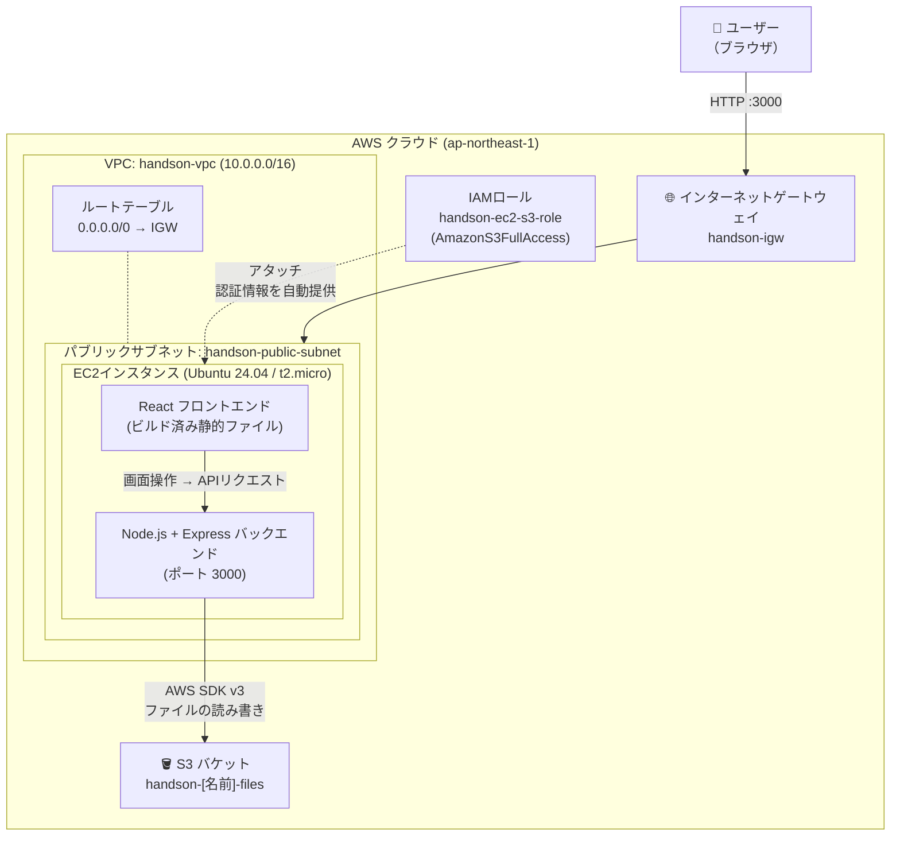

# EC2・S3・IAM セットアップ手順（Phase 1 ハンズオン）

作成日: 2026-05-09
更新日: 2026-05-09（AWS用語集を追加）

対象: AWS未経験者向けハンズオン（1回目）

---

## 環境イメージ




## ゴール

S3バケットにファイルをアップロード・一覧表示・ダウンロード・削除できるWebアプリをEC2上で動かす。

## 全体の流れ

```
[1] VPC作成（ネットワーク環境の準備）
    ↓
[2] S3バケット作成
    ↓
[3] IAMロール作成（EC2がS3にアクセスできる権限）
    ↓
[4] EC2インスタンス起動（VPC内に配置・IAMロールをアタッチ）
    ↓
[5] EC2にSSH接続・Node.jsセットアップ
    ↓
[6] GitHubからアプリをクローン・ビルド・起動
    ↓
[7] ブラウザで動作確認
```

---

## AWS 用語集（手順を始める前に読んでおこう）

手順中に出てくる言葉を事前に把握しておくと、何をやっているのかが理解しやすくなる。

---

### AWS全般

#### AWSマネジメントコンソール
ブラウザ上で AWS のサービスを操作する管理画面。
EC2・S3・IAM はすべてここから設定する。
URL: https://console.aws.amazon.com/

#### リージョン
AWS のデータセンターが集まっている地理的な場所。
「東京リージョン（ap-northeast-1）」「大阪リージョン（ap-northeast-3）」などがある。
**作ったリソース（EC2・S3など）はリージョンをまたいでは見えない。**
コンソール右上で選択できるので、作業前に「東京」になっているか確認する習慣をつけること。

#### アベイラビリティゾーン（AZ）
リージョンの中にある個別のデータセンター群。東京リージョンには `ap-northeast-1a`〜`1d` がある。
1つのAZが障害になっても他のAZは動き続ける設計になっている。
Phase 1 では意識しなくてよいが、後のフェーズで出てくる。

#### 無料利用枠（Free Tier）
AWS に新規登録してから12か月間、一定の利用量まで無料で使える枠。
`t2.micro` のEC2は月750時間まで無料。S3は5GBまで無料。
**ただし停止し忘れると無料枠を超えて課金されることがあるため注意。**

---

### VPC（Virtual Private Cloud）

#### VPC
AWS上に作る「自分専用のプライベートネットワーク」。
EC2などのリソースはこのVPCの中に配置する。
自分のオフィスにLANを引くようなイメージ。

```
インターネット
    ↓
インターネットゲートウェイ（出入口）
    ↓
VPC（自分専用ネットワーク）
    └─ サブネット（部屋）
           └─ EC2（サーバー）
```

今回は以下の構成で作成する:

| リソース | 名前 | 値 |
|---------|------|-----|
| VPC | handson-vpc | CIDR: 10.0.0.0/16 |
| サブネット | handson-public-subnet | CIDR: 10.0.0.0/24 / AZ: ap-northeast-1a |
| インターネットゲートウェイ | handson-igw | VPCにアタッチ |
| ルートテーブル | handson-public-rt | 0.0.0.0/0 → handson-igw |

#### CIDR（サイダー）
ネットワークの範囲を表す記法。`10.0.0.0/16` の `/16` が「何ビット分をネットワーク部に使うか」を示す。
数字が小さいほどIPアドレスの範囲が広くなる。

| CIDR | 使えるIPアドレス数 | 用途 |
|------|-----------------|------|
| /16 | 約65,000個 | VPC全体（広め） |
| /24 | 256個 | サブネット（今回はこれ） |

難しく考えなくてよい。今回は `VPC=10.0.0.0/16`、`サブネット=10.0.0.0/24` と覚えておけばOK。

#### サブネット（Subnet）
VPCをさらに分割した「部屋」。
- **パブリックサブネット**: インターネットと通信できる。EC2をここに置く
- **プライベートサブネット**: インターネットと直接通信できない。DBサーバーなどを置く

今回はパブリックサブネット1つだけ作成する。

#### インターネットゲートウェイ（IGW）
VPCとインターネットをつなぐ「出入口」。
これをVPCにアタッチしないと、EC2はインターネットと通信できない。

#### ルートテーブル
「このIPアドレス宛の通信はどこに送るか」を定義した経路表。
`0.0.0.0/0 → handson-igw` という設定は「インターネット宛の通信はIGWへ送る」という意味。
サブネットに関連付けることで効果を発揮する。

---

### EC2（Elastic Compute Cloud）

#### EC2
AWS が提供する仮想サーバー。
「クラウド上に自分専用のパソコンを借りる」イメージ。
今回はこのサーバー上で Node.js アプリを動かす。

#### インスタンス
EC2の仮想サーバー1台のこと。
「EC2インスタンスを起動する」＝「仮想サーバーを1台立ち上げる」という意味。

#### AMI（Amazon Machine Image）
インスタンスを起動するときのOS設定の雛形。
今回は `Ubuntu Server 24.04 LTS` を使う。
「Windowsをインストールするか、Ubuntuをインストールするか」をここで選ぶイメージ。

#### インスタンスタイプ
仮想サーバーのスペック（CPU・メモリの大きさ）のこと。
`t2.micro` は vCPU 1・メモリ 1GB の最小クラス。無料利用枠の対象。
大きなアプリを動かすときは `t3.medium` などより大きなタイプを選ぶ。

#### キーペア（.pem ファイル）
SSH 接続するための「カギ」。公開鍵（AWSが保持）と秘密鍵（.pem ファイルとして自分がダウンロード）がセット。
**一度しかダウンロードできないので、大切に保管すること。紛失すると SSH できなくなる。**

#### SSH（Secure Shell）
ネットワーク越しにサーバーを安全に操作するためのプロトコル。
ターミナルから `ssh -i キーファイル ubuntu@IPアドレス` と打つと、EC2のターミナルを自分のPCから操作できる。

#### セキュリティグループ
EC2への「ネットワーク入口の門番」。
どのIPアドレスからどのポートへの通信を許可するか・拒否するかを設定する。
今回は SSH（22番）と アプリ（3000番）のみ開放する。

| ポート番号 | 用途 |
|-----------|------|
| 22 | SSH接続（サーバー操作） |
| 80 | HTTP（Webブラウザ）|
| 443 | HTTPS（暗号化されたWeb） |
| 3000 | 今回のアプリ |

#### パブリックIPアドレス
インターネットから EC2 に接続するためのIPアドレス。
`http://[パブリックIP]:3000` でアプリにアクセスできる。
**EC2を停止→起動するたびにIPアドレスが変わる点に注意。**

#### EBS（Elastic Block Store）
EC2 にアタッチされる仮想ハードディスク。
EC2 を停止してもデータは消えないが、EC2 を「終了（削除）」するとデータも消える。

---

### S3（Simple Storage Service）

#### S3
AWS のオブジェクトストレージサービス。
ファイルをインターネット越しに保存・取得できる「クラウド上のハードディスク」のようなもの。
容量上限がなく、画像・動画・バックアップなど何でも保存できる。

#### バケット
S3 の中のファイルを入れる「箱（フォルダのようなもの）」。
名前は **全世界でユニーク**（同じ名前のバケットは地球上に1つしか作れない）。
リージョンごとに作成するが、バケット名は全世界共通の名前空間。

#### オブジェクト
S3 に保存されたファイル1件のこと。
ファイル本体（データ）＋メタデータ（更新日時・サイズ・ContentTypeなど）をまとめて「オブジェクト」と呼ぶ。

#### オブジェクトキー
S3 内でオブジェクトを識別する「ファイルパス」のようなもの。
例: `documents/report.pdf` というキーで保存すると、フォルダ階層があるように見える（実際にはフォルダは存在せず、スラッシュを含む文字列）。

#### パブリックアクセスのブロック
S3 バケットをインターネットに公開するかどうかの設定。
今回は **オン（ブロックする）** にする。EC2 経由でアクセスするため、S3 を直接公開する必要がない。
うっかりオフにすると個人情報などが誰でも見られる状態になるため注意。

---

### IAM（Identity and Access Management）

#### IAM
AWS リソースへのアクセス権限を管理するサービス。
「誰が」「何を」「どのくらい」できるかを細かく制御できる。

#### ポリシー
「何ができるか（権限の内容）」を JSON で定義したもの。
例: `AmazonS3FullAccess` → S3 の全操作（読み書き削除）を許可するポリシー。
AWS があらかじめ用意した「管理ポリシー」と、自分で細かく書く「カスタムポリシー」がある。

> **本番環境では最小権限の原則を守ること。**
> 「S3の読み取りだけできれば良い」ならば `AmazonS3ReadOnlyAccess` を使う。
> ハンズオンでは学習のため `FullAccess` を使うが、本番では必要最小限にする。

#### IAMロール
「AWS サービス自身に渡す権限のセット」。
人間のユーザーではなく、EC2・Lambda などの **サービスが使う** ための権限証明書。
今回は EC2 に S3 へのアクセス権限を与えるために `handson-ec2-s3-role` というロールを作り、EC2 にアタッチする。

#### アタッチ
ポリシーをロールに紐付けたり、ロールをEC2に紐付けたりすること。
「権限を渡す」行為のこと。

#### IAMロールをEC2にアタッチする仕組み
```
IAMロール（handson-ec2-s3-role）
    └── ポリシー: AmazonS3FullAccess がアタッチされている
          ↓
    EC2インスタンスに紐付ける
          ↓
    EC2上で動くアプリが自動的に S3 への権限を得る
    （アクセスキーの設定が不要になる）
```

---

## コード用語集（手順を始める前に読んでおこう）

アプリのセットアップ手順（[4]〜[5]）で使う言葉を解説する。

---

### Web・通信の基礎

#### フロントエンド / バックエンド

```
[ブラウザ] ←→ [フロントエンド] ←→ [バックエンド] ←→ [S3]
  ユーザーが        画面の表示          データ処理・        ファイル
  見る部分          HTML/CSS/JS         API の提供          保存先
```

- **フロントエンド**: ブラウザ上で動くUI部分。今回は React（JavaScript）で書かれている
- **バックエンド**: サーバー上で動くプログラム。今回は Node.js + Express で書かれている。S3への実際の操作はここが行う

#### HTTP / HTTPS
ブラウザとサーバーがデータをやり取りするための通信ルール（プロトコル）。
- `http://` は暗号化なし。今回のハンズオンはこちら
- `https://` は暗号化あり。本番環境では必須

ブラウザで `http://[EC2のIP]:3000` にアクセスすると、EC2のサーバーへ HTTP リクエストが飛ぶ。

#### ポート（Port）
1台のサーバーが複数のサービスを同時に動かすときの「窓口番号」。
`http://192.168.1.1:3000` の `:3000` がポート番号。

| ポート | 使われ方 |
|-------|---------|
| 80 | 通常の Web（http://） |
| 443 | 暗号化された Web（https://） |
| 22 | SSH（サーバー操作） |
| 3000 | 今回のアプリ（開発用によく使われる番号） |

#### REST API
フロントエンドとバックエンドがデータをやり取りするときの取り決め。
URL と HTTP メソッドの組み合わせで「何をしたいか」を表現する。

| メソッド | 意味 | 今回の使われ方 |
|---------|------|-------------|
| GET | 取得する | ファイル一覧の取得、ダウンロード |
| POST | 新しく作る・送る | ファイルのアップロード |
| DELETE | 削除する | ファイルの削除 |

#### JSON（JavaScript Object Notation）
データをテキストで表現するフォーマット。API のレスポンスによく使われる。
```json
{
  "key": "report.pdf",
  "size": 102400,
  "lastModified": "2026-05-09T10:00:00Z"
}
```
バックエンドがこの形式でファイル情報を返し、フロントエンドが受け取って画面に表示する。

---

### Node.js / npm

#### Node.js
JavaScript をブラウザ以外（サーバー上）で動かすための実行環境。
今回のバックエンドは Node.js 上で動く。EC2 にインストールするのはこれ。

#### npm（Node Package Manager）
Node.js のパッケージ（ライブラリ）を管理するツール。
「必要な部品を自動で取ってくる」役割。

```bash
npm install       # package.json に書かれた依存ライブラリを一括インストール
npm run build     # TypeScript → JavaScript に変換してアプリを本番向けにまとめる
npm start         # アプリを起動する
```

#### package.json
そのアプリが依存しているライブラリの一覧と、使えるコマンドが書かれた設定ファイル。
`npm install` を実行すると、ここに書かれたライブラリが自動でダウンロードされる。

```json
{
  "dependencies": {
    "express": "^4.21.0",    ← アプリの動作に必要なライブラリ
    "@aws-sdk/client-s3": "^3.0.0"
  },
  "scripts": {
    "build": "tsc",          ← npm run build で実行されるコマンド
    "start": "node dist/index.js"  ← npm start で実行されるコマンド
  }
}
```

#### node_modules/
`npm install` でダウンロードされたライブラリが入るフォルダ。
サイズが大きく（数百MB）、GitHub にはアップロードしない（`.gitignore` で除外）。
EC2 でも毎回 `npm install` を実行してダウンロードし直す。

#### .env ファイル
アプリの設定値（S3バケット名など）を記述するファイル。
ソースコードに直接書かずに外部ファイルにまとめることで、本番・ローカルで値を切り替えやすくなる。

```
S3_BUCKET_NAME=handson-yamada-files
AWS_REGION=ap-northeast-1
```

**`.env` は GitHub にアップロードしてはいけない。**
アクセスキーなどの機密情報が含まれることがあるため。

---

### TypeScript / ビルド

#### TypeScript
JavaScript に「型」を追加した言語。
変数や関数の引数に型を指定することで、バグを事前に防ぎやすくなる。
ブラウザや Node.js は JavaScript しか実行できないため、**ビルド**が必要。

```typescript
// TypeScript（.ts）で書いたコード
function greet(name: string): string {
  return `こんにちは、${name}さん`
}
```

#### ビルド（コンパイル）
TypeScript（`.ts`）のコードを、Node.js やブラウザが実行できる JavaScript（`.js`）に変換する作業。
`npm run build` を実行すると自動で行われる。

```
TypeScript (.ts) ──[ビルド]──→ JavaScript (.js)
  人間が書く                     サーバーが実行する
```

#### dist/ フォルダ
ビルドした JavaScript ファイルが出力されるフォルダ。
`npm run build` を実行すると生成される。
`npm start` は `dist/index.js` を実行する。

```
backend/
├── src/         ← 人間が書く TypeScript ファイル
│   └── index.ts
└── dist/        ← ビルドで生成される JavaScript ファイル（自動生成）
    └── index.js
```

---

### Express（バックエンドフレームワーク）

#### Express
Node.js で Web サーバーを作るためのフレームワーク（部品集）。
「どの URL にアクセスされたら何を返すか」を簡潔に書ける。

```typescript
app.get('/api/files', (req, res) => {
  // GET /api/files にアクセスされたときの処理
  res.json([{ key: 'report.pdf', size: 1024 }])
})
```

#### エンドポイント
API の「受け付け窓口」。URL と HTTP メソッドの組み合わせのこと。
今回のアプリは以下のエンドポイントを持つ:

| エンドポイント | 処理 |
|-------------|------|
| `GET /api/files` | S3のファイル一覧を返す |
| `POST /api/files/upload` | ファイルをS3にアップロード |
| `GET /api/files/download/:key` | S3からファイルをダウンロード |
| `DELETE /api/files/:key` | S3のファイルを削除 |

---

### React / Vite（フロントエンド）

#### React
Facebook が開発した JavaScript の UI ライブラリ。
「コンポーネント」という部品を組み合わせて画面を作る。
今回の「ファイル一覧」「アップロードボタン」はそれぞれ別のコンポーネントとして作られている。

#### Vite（ヴィート）
React アプリの開発サーバーを高速に起動するツール。
ローカル開発では `npm run dev` でViteが起動し `http://localhost:5173` でアプリが見られる。
`npm run build` を実行すると `dist/` フォルダに本番用のファイルが出力される。

#### SPA（Single Page Application）
ページ遷移のたびにHTMLを再読み込みせず、JavaScript でページ内容を書き換えるWebアプリの形式。
今回のフロントエンドはSPA。ブラウザが最初にHTMLを1回読み込み、以降は API でデータだけ取得して画面を更新する。

---

### Git / GitHub

#### Git
ソースコードのバージョン管理ツール。「いつ・誰が・何を変えたか」の履歴を記録できる。

#### GitHub
Git のリポジトリをインターネット上に保存・公開できるサービス。
今回のアプリコードは GitHub で管理し、EC2 からクローンして使う。

#### git clone
GitHub 上のリポジトリをEC2にコピーしてくるコマンド。

```bash
git clone https://github.com/ohtsuka-shota-se/samurai-repo.git
# → samurai-repo/ フォルダが作成される
```

#### git pull
すでにクローン済みのリポジトリに、GitHub 側の最新変更を取り込むコマンド。
コードが更新された際に EC2 へ反映するために使う。

```bash
git pull   # GitHub の最新版でローカルを更新する
```

---

### AWS SDK

#### AWS SDK（Software Development Kit）
アプリのコードから AWS のサービスを操作するためのライブラリ。
今回は `@aws-sdk/client-s3` を使い、Node.js のコードから S3 にファイルを保存・取得している。
SDK が IAMロールの認証情報を自動で読み取るため、アクセスキーをコードに書かなくて済む。

```typescript
// SDK を使ったS3操作のイメージ
const s3 = new S3Client({ region: 'ap-northeast-1' })
await s3.send(new ListObjectsV2Command({ Bucket: 'handson-yamada-files' }))
// → S3バケットのファイル一覧が返ってくる
```

---

## [1] VPC作成

EC2を置くためのプライベートネットワーク環境を作る。

### 1-1. VPCを作成する

1. サービス検索で「VPC」を開く
2. 左メニュー「お客様の VPC」→「VPCを作成」
3. 以下を設定:

| 項目 | 設定値 |
|------|-------|
| 作成するリソース | **VPCのみ** |
| 名前タグ | `handson-vpc` |
| IPv4 CIDR | `10.0.0.0/16` |
| IPv6 CIDR | なし |
| テナンシー | デフォルト |

4. 「VPCを作成」をクリック

---

### 1-2. インターネットゲートウェイを作成してアタッチする

1. 左メニュー「インターネットゲートウェイ」→「インターネットゲートウェイの作成」
2. 名前タグ: `handson-igw` → 「インターネットゲートウェイの作成」
3. 作成後、画面上部の「**VPCにアタッチ**」をクリック
4. `handson-vpc` を選択 → 「インターネットゲートウェイのアタッチ」

---

### 1-3. パブリックサブネットを作成する

1. 左メニュー「サブネット」→「サブネットを作成」
2. 以下を設定:

| 項目 | 設定値 |
|------|-------|
| VPC ID | `handson-vpc` |
| サブネット名 | `handson-public-subnet` |
| アベイラビリティゾーン | `ap-northeast-1a`（東京） |
| IPv4 CIDR | `10.0.0.0/24` |

3. 「サブネットを作成」をクリック
4. 作成したサブネットを選択 →「アクション」→「**サブネットの設定を編集**」
5. 「パブリック IPv4 アドレスの自動割り当てを有効化」に**チェックを入れて保存**
   - これを有効にしないと EC2 にパブリックIPが割り当てられない

---

### 1-4. ルートテーブルを作成してサブネットに関連付ける

1. 左メニュー「ルートテーブル」→「ルートテーブルを作成」
2. 以下を設定:

| 項目 | 設定値 |
|------|-------|
| 名前 | `handson-public-rt` |
| VPC | `handson-vpc` |

3. 「ルートテーブルを作成」をクリック
4. 作成した `handson-public-rt` を選択 →「**ルート**」タブ→「ルートを編集」
5. 「ルートを追加」をクリックし以下を入力:

| 送信先 | ターゲット |
|--------|----------|
| `0.0.0.0/0` | `handson-igw`（インターネットゲートウェイ） |

6. 「変更を保存」
7. 「**サブネットの関連付け**」タブ →「サブネットの関連付けを編集」
8. `handson-public-subnet` にチェックを入れて「関連付けを保存」

---

## [2] S3バケット作成


1. AWSマネジメントコンソールにログイン
2. サービス検索で「S3」を開く
3. 「バケットを作成」をクリック
4. 以下を設定:

| 項目 | 設定値 |
|------|-------|
| バケット名 | `handson-[自分の名前]-files`（例: `handson-yamada-files`）※全世界で一意 |
| AWSリージョン | アジアパシフィック（東京） ap-northeast-1 |
| オブジェクト所有権 | ACL無効 |
| パブリックアクセスをすべてブロック | **オン**（デフォルトのまま） |
| バージョニング | 無効 |

5. 「バケットを作成」をクリック
6. **作成したバケット名をメモしておく**

---

## [3] IAMロール作成

EC2がS3にアクセスするための「通行証」（IAMロール）を作る。

1. サービス検索で「IAM」を開く
2. 左メニュー「ロール」→「ロールを作成」
3. 以下を設定:

**ステップ1: 信頼されたエンティティを選択**
- エンティティタイプ: **AWSのサービス**
- ユースケース: **EC2**
- 「次へ」

**ステップ2: 許可ポリシー**
- 検索欄に `AmazonS3FullAccess` と入力
- `AmazonS3FullAccess` にチェックを入れる
- 「次へ」

**ステップ3: 名前と確認**
- ロール名: `handson-ec2-s3-role`
- 「ロールを作成」

---

## [4] EC2インスタンス起動

1. サービス検索で「EC2」を開く
2. 「インスタンスを起動」をクリック
3. 以下を設定:

| 項目 | 設定値 |
|------|-------|
| 名前 | `handson-server` |
| AMI | Ubuntu Server 24.04 LTS（64ビット x86） |
| インスタンスタイプ | `t2.micro`（無料利用枠） |
| キーペア | 新しいキーペアを作成 → 名前: `handson-key`、タイプ: RSA、形式: .pem → ダウンロードして保存 |

**ネットワーク設定:**

| 項目 | 設定値 |
|------|-------|
| VPC | `handson-vpc` |
| サブネット | `handson-public-subnet` |
| パブリックIPの自動割り当て | **有効**（サブネット設定に従う） |

「セキュリティグループを作成」を選択し、以下のルールを追加:

| タイプ | ポート | ソース | 用途 |
|------|-------|--------|------|
| SSH | 22 | マイIP | EC2への接続 |
| カスタムTCP | 3000 | 0.0.0.0/0 | アプリへのアクセス |

**高度な詳細:**
- IAMインスタンスプロファイル: `handson-ec2-s3-role` を選択

4. 「インスタンスを起動」をクリック
5. インスタンス一覧に戻り、**パブリックIPアドレスをメモ**（起動完了後に表示される）

---

## [5] EC2にSSH接続・Node.jsセットアップ

### SSHの接続

**Mac / Linux の場合:**
```bash
chmod 400 ~/Downloads/handson-key.pem
ssh -i ~/Downloads/handson-key.pem ubuntu@[EC2のパブリックIP]
```

**Windows（PowerShell）の場合:**
```powershell
ssh -i C:\Users\[ユーザー名]\Downloads\handson-key.pem ubuntu@[EC2のパブリックIP]
```

接続できたら以下が表示される:
```
ubuntu@ip-xxx-xxx-xxx-xxx:~$
```

### Node.jsのインストール

```bash
# rootに切り替えてパッケージ一覧の更新
sudo su -
apt update && apt upgrade -y

# Node.js 22.x のインストール（LTS）
curl -fsSL https://deb.nodesource.com/setup_22.x | bash -
apt-get install -y nodejs

# バージョン確認
node -v   # v22.x.x と表示されればOK
npm -v    # 10.x.x と表示されればOK
```

---

## [6] アプリのクローン・ビルド・起動

### 5-1. リポジトリをクローンする

**実行場所: ホームディレクトリ `~`**

```bash
git clone https://github.com/ohtsuka-shota-se/samurai-repo.git
```

実行後、`samurai-repo` フォルダが作成される。

---

### 5-2. フロントエンドをビルドする

**実行場所: `~/samurai-repo/phase01/frontend`**

```bash
cd ~/samurai-repo/phase01/frontend
npm install
npm run build
```

`dist/` フォルダが生成されれば成功。

---

### 5-3. バックエンドをセットアップする

**実行場所: `~/samurai-repo/phase01/backend`**

```bash
cd ~/samurai-repo/phase01/backend
npm install
```

---

### 5-4. S3バケット名を設定する

**実行場所: `~/samurai-repo/phase01/backend`（5-3の続き）**

```bash
cp .env.example .env
nano .env
```

`nano` が開いたら `S3_BUCKET_NAME=` の右側を自分のバケット名に書き換える:

```
S3_BUCKET_NAME=handson-yamada-files   ← ここだけ変更する
```

保存して終了: `Ctrl + O` → `Enter` → `Ctrl + X`

---

### 5-5. ビルドして起動する

**実行場所: `~/samurai-repo/phase01/backend`（5-3の続き）**

```bash
npm run build
npm start
```

以下のように表示されたら起動成功:

```
サーバー起動: http://localhost:3000
S3バケット: handson-yamada-files
```

---

> **EC2再起動後のアプリ再起動手順:**
> EC2を停止→起動した場合、アプリは自動起動しない。再度SSHで接続して以下を実行する。
> また、停止→起動するとパブリックIPが変わる点に注意。
>
> **実行場所: `~/samurai-repo/phase01/backend`**
> ```bash
> cd ~/samurai-repo/phase01/backend
> npm start
> ```

---

> **コードが更新された場合のEC2への適用手順:**
>
> **実行場所: `~/samurai-repo`**
> ```bash
> cd ~/samurai-repo
> git pull
> cd phase01/frontend
> npm install
> npm run build
> cd ../backend
> npm install
> npm run build
> npm start
> ```

---

## [7] ブラウザで動作確認

ブラウザで以下にアクセス:
```
http://[EC2のパブリックIP]:3000
```

### 動作確認チェックリスト

- [ ] 画面が表示される（「AWS S3 ファイル管理」というタイトル）
- [ ] ファイル一覧が表示される（初回は「ファイルがありません」と表示）
- [ ] ファイルをアップロードできる（日本語ファイル名も含む）
- [ ] アップロードしたファイルが一覧に表示される
- [ ] ファイルをダウンロードできる
- [ ] ファイルを削除できる
- [ ] S3コンソールでも同じファイルが確認できる

---

## トラブルシューティング

### 画面が表示されない場合

1. EC2のセキュリティグループでポート3000が開放されているか確認
2. アプリが起動しているか確認（ターミナルにエラーが出ていないか）

---

### 「ファイル一覧の取得に失敗しました」と表示される場合

**手順1: IAMロールがEC2に認識されているか確認**

通常の curl では応答がない場合がある。以下のIMDSv2形式で確認すること:

```bash
TOKEN=$(curl -s -X PUT "http://169.254.169.254/latest/api/token" -H "X-aws-ec2-metadata-token-ttl-seconds: 21600")
curl -s -H "X-aws-ec2-metadata-token: $TOKEN" http://169.254.169.254/latest/meta-data/iam/info
```

`"Code" : "Success"` が返れば認識されている。何も返らない場合はIAMロールがアタッチされていない。

→ EC2コンソール →「アクション」→「セキュリティ」→「IAMロールを変更」でロールをアタッチする。

**手順2: Node.jsでS3接続を直接テスト**

Ubuntu 24.04 では `apt install awscli` が使えない。代わりに以下で確認:

```bash
# バックエンドフォルダで実行
cd ~/samurai-repo/phase01/backend

node -e "
const { S3Client, ListObjectsV2Command } = require('@aws-sdk/client-s3');
const client = new S3Client({ region: 'ap-northeast-1' });
client.send(new ListObjectsV2Command({ Bucket: '[バケット名]' }))
  .then(r => console.log('接続成功'))
  .catch(e => console.error('エラー:', e.name, e.message));
"
```

**手順3: .envファイルの確認**

```bash
cat ~/samurai-repo/phase01/backend/.env
```

`S3_BUCKET_NAME` が正しいバケット名になっているか確認する。

---

### ハンズオン終了時の注意（費用発生を防ぐため）

EC2は**起動中に料金が発生**します。ハンズオン終了後は必ず停止すること。

1. EC2コンソールでインスタンスを選択
2. 「インスタンスの状態」→「インスタンスを停止」

> ※「終了（削除）」すると次回使えなくなる。「停止」にする。
> ※ 停止中はEC2の料金は発生しないが、EBSの料金はわずかに発生する（無料枠内に収まる）。
