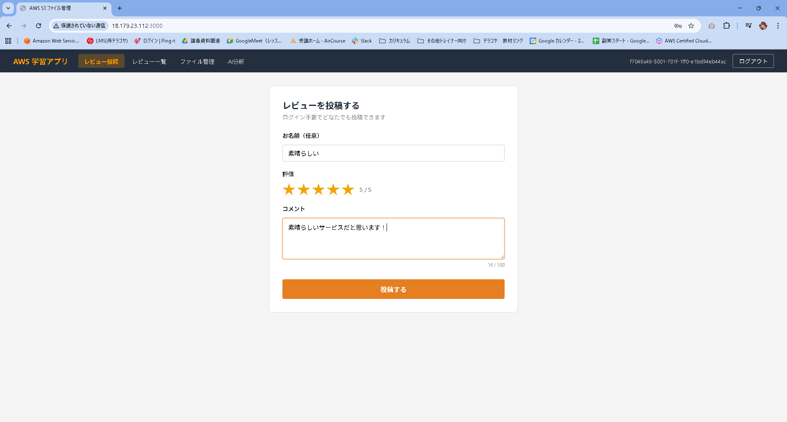
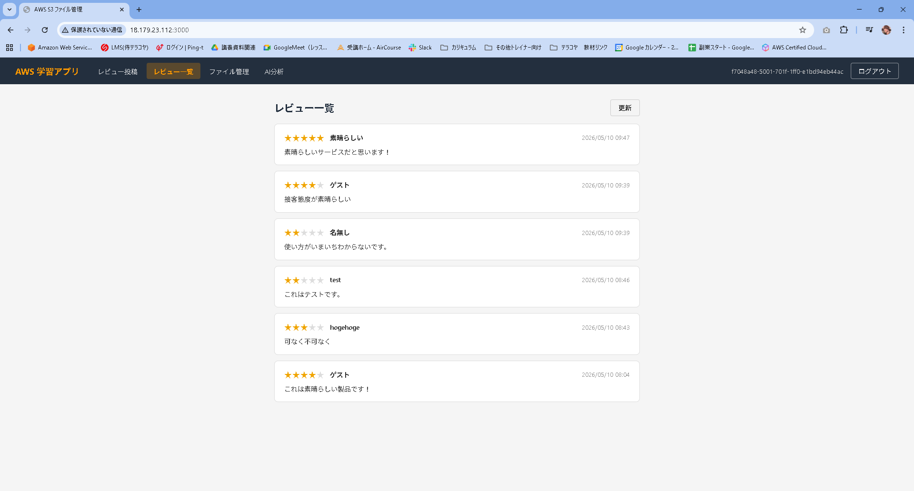
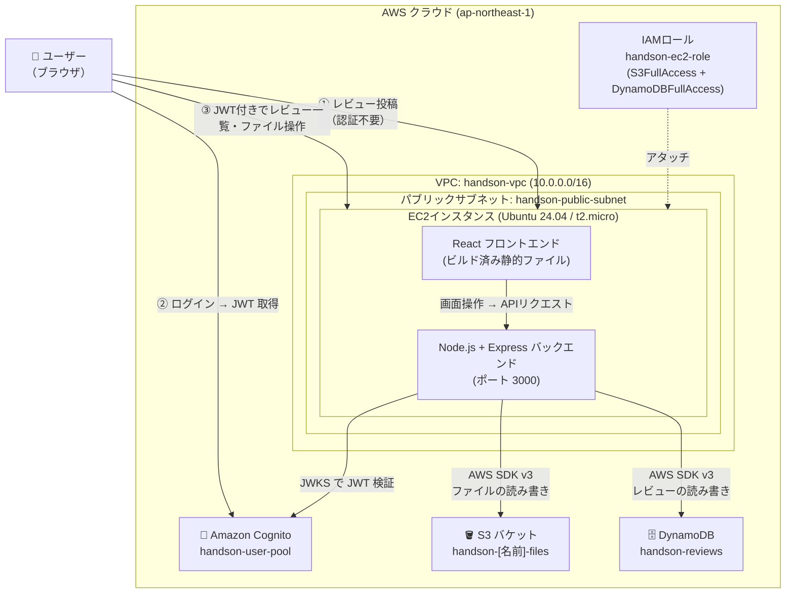
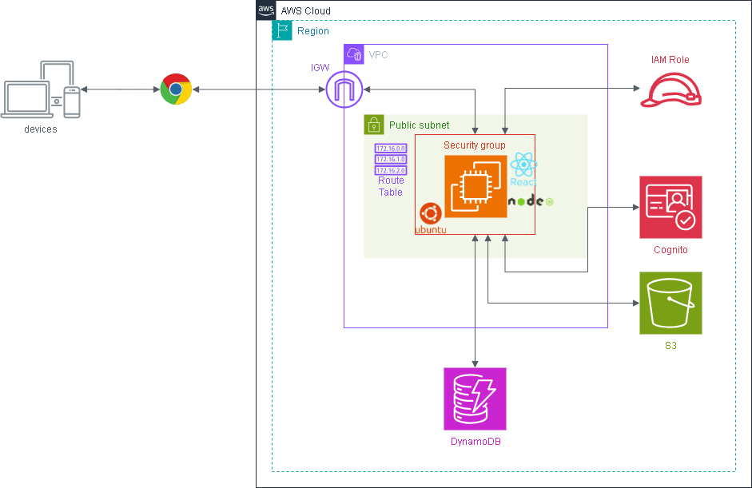
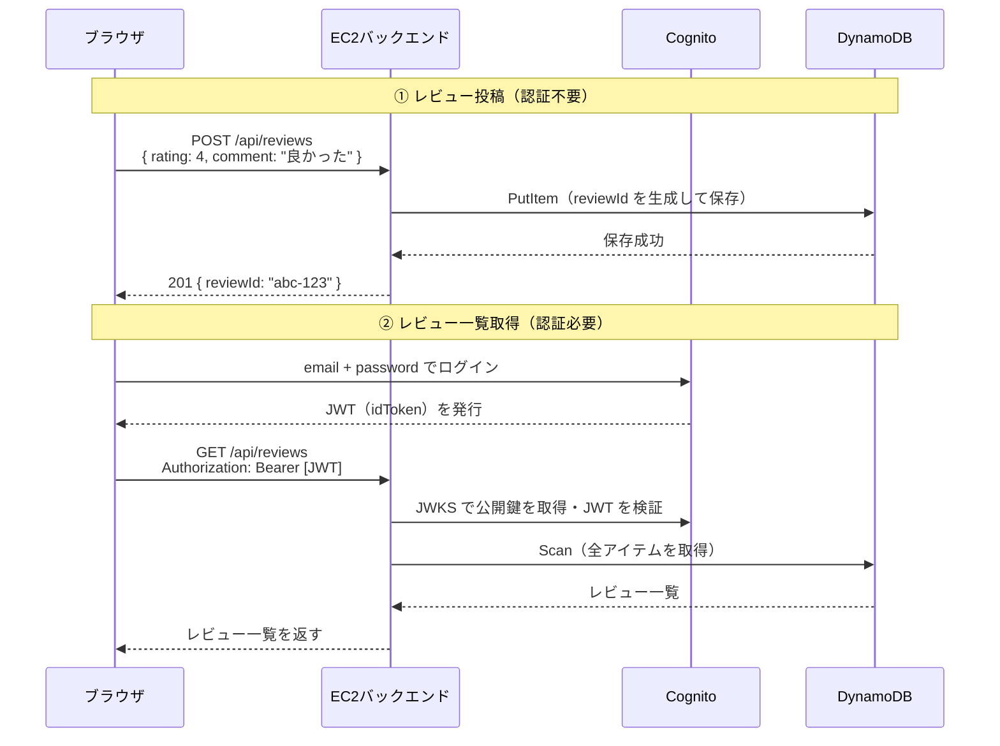

# DynamoDB セットアップ手順（Phase 3 ハンズオン）

作成日: 2026-05-10
更新日: 2026-05-10（環境イメージ・用語集・仕組みの説明を追加）

対象: AWS未経験者向けハンズオン（3回目）

---
## 完成後イメージ



## 環境イメージ





## ゴール

ログイン不要でレビューを投稿でき、ログイン後にレビュー一覧・詳細が見られるアプリを動かす。

## 全体の流れ

```
[1] DynamoDB テーブル作成
    ↓
[2] IAMロールに DynamoDB 権限を追加
    ↓
[3] バックエンドの .env 設定
    ↓
[4] EC2でアプリを更新・起動
    ↓
[5] ブラウザで動作確認
```

---

## AWS 用語集（手順を始める前に読んでおこう）

Phase 1・2 の用語集に加えて、Phase 3 で新たに登場する言葉を解説する。

---

### DynamoDB

#### Amazon DynamoDB
AWS が提供するフルマネージドの NoSQL データベース。
サーバーの管理が不要で、データが自動的にスケールする。
今回はレビューデータの保存・取得に使う。

```
RDB（MySQLなど）との違い:
  RDB:      テーブルに列の定義が必要。SQLで操作する
  DynamoDB: 列の定義が不要。アイテムごとに異なる属性を持てる
```

無料枠: 25GB ストレージ・読み書き25ユニットまで**永続無料**（12ヶ月制限なし）。

#### テーブル
DynamoDB でデータを入れる「箱」。RDB のテーブルに相当するが、スキーマ（列の定義）が不要。

#### アイテム
テーブルに保存されるデータの1件。RDB の「行」に相当。

#### 属性
アイテムの中の各フィールド。RDB の「列」に相当するが、アイテムごとに異なる属性を持てる。

#### パーティションキー（PK）
アイテムを一意に識別するキー。今回は `reviewId`（UUID）を使う。
DynamoDB はこのキーをもとにデータを分散保存する。

```
今回のテーブル設計:
  reviewId（PK） │ rating │ comment │ userName │ createdAt
  ───────────────┼────────┼─────────┼──────────┼──────────
  abc-123...     │   4    │ 良かった │ 田中     │ 2026-05-10T...
  def-456...     │   5    │ 最高！  │ ゲスト   │ 2026-05-10T...
```

#### Scan
テーブルの全アイテムを読み込む操作。
データ量が多いと遅くなるが、学習用途では問題ない。
今回のレビュー一覧取得に使う。

#### PutItem
テーブルにアイテムを追加（または上書き）する操作。
今回のレビュー投稿時に使う。

#### GetItem
パーティションキーを指定してアイテムを1件取得する操作。
今回のレビュー詳細表示時に使う。

---

### 認証制御

#### 公開エンドポイントと保護エンドポイント
今回のアプリは API によって認証の要否を切り替えている。

| エンドポイント | 認証 | 理由 |
|-------------|------|------|
| `POST /api/reviews` | 不要 | 誰でもレビュー投稿できる |
| `GET /api/reviews` | 必要（JWT） | ログイン済みユーザーのみ閲覧できる |
| `GET /api/reviews/:id` | 必要（JWT） | 同上 |
| `GET/POST/DELETE /api/files` | 必要（JWT） | Phase 2 から継続 |

---

## コード用語集（手順を始める前に読んでおこう）

---

### AWS SDK for DynamoDB

#### @aws-sdk/lib-dynamodb（DocumentClient）
DynamoDB を扱いやすくするラッパーライブラリ。
通常の DynamoDB SDK はデータ型を `{ S: "文字列" }` や `{ N: "42" }` のように明示する必要があるが、
DocumentClient を使うと JavaScript のオブジェクトをそのまま読み書きできる。

```typescript
// DocumentClient なし（冗長）
{ reviewId: { S: "abc-123" }, rating: { N: "4" } }

// DocumentClient あり（シンプル）
{ reviewId: "abc-123", rating: 4 }
```

#### randomUUID
Node.js 組み込みの関数で、UUID（世界でほぼ一意の文字列）を生成する。
外部ライブラリ不要で使える。

```typescript
import { randomUUID } from 'crypto'
randomUUID() // → "550e8400-e29b-41d4-a716-446655440000"
```

レビューの `reviewId` はこれで生成する。

---

## 仕組みの説明（学習者向け）



**ポイント:**
- レビュー投稿は JWT なしで EC2 → DynamoDB に直接書き込む
- レビュー一覧はバックエンドが JWT を検証してから DynamoDB に問い合わせる
- EC2 は IAMロールの権限で DynamoDB にアクセスする（アクセスキー不要）

---

## [1] DynamoDB テーブル作成

1. AWSマネジメントコンソール → 「DynamoDB」を開く
2. 「テーブルを作成」をクリック
3. 以下を設定:

| 項目 | 設定値 |
|------|-------|
| テーブル名 | `handson-reviews` |
| パーティションキー | `reviewId`（型: 文字列） |
| ソートキー | 設定しない |
| テーブル設定 | **デフォルト設定** のまま |

4. 「テーブルを作成」をクリック
5. ステータスが「アクティブ」になるまで待つ（1〜2分）

---

## [2] IAMロールに DynamoDB 権限を追加

Phase 1 で作成した `handson-ec2-role` に DynamoDB へのアクセス権限を追加する。

1. AWSマネジメントコンソール → 「IAM」を開く
2. 左メニュー「ロール」→ `handson-ec2-role` をクリック
3. 「許可を追加」→「ポリシーをアタッチ」
4. 検索欄に `AmazonDynamoDBFullAccess_v2` と入力
5. `AmazonDynamoDBFullAccess_v2` にチェックを入れて「許可を追加」

> **本番環境では最小権限にすること**
> ハンズオンでは学習のため FullAccess を使うが、本番では
> 特定のテーブルへの読み書きのみに絞ったカスタムポリシーを使う。

---

## [3] バックエンドの .env 設定

**まず EC2 に SSH 接続し、root に切り替えて最新コードを取得する:**

```bash
sudo su -
cd ~/samurai-repo
git pull
```

`phase03/` フォルダが表示されれば取得成功。

**実行場所: `~/samurai-repo/phase03/backend`**

```bash
cd ~/samurai-repo/phase03/backend
cp .env.example .env
nano .env
```

以下のように書き換える（Cognito の値は Phase 2 と同じ）:

```
S3_BUCKET_NAME=handson-yamada-files
COGNITO_USER_POOL_ID=ap-northeast-1_xxxxxxxx
COGNITO_CLIENT_ID=xxxxxxxxxxxxxxxxxxxxxxxxxx
DYNAMODB_TABLE_NAME=handson-reviews
```

保存して終了: `Ctrl + O` → `Enter` → `Ctrl + X`

フロントエンドの .env も設定する:

```bash
cd ~/samurai-repo/phase03/frontend
cp .env.example .env
nano .env
```

```
VITE_COGNITO_USER_POOL_ID=ap-northeast-1_xxxxxxxx
VITE_COGNITO_CLIENT_ID=xxxxxxxxxxxxxxxxxxxxxxxxxx
```

保存して終了: `Ctrl + O` → `Enter` → `Ctrl + X`

---

## [4] EC2でアプリを更新・起動

**実行場所: `~/samurai-repo`**（[3] の続き。すでに root かつ git pull 済みの前提）

```bash
cd ~/samurai-repo

# フロントエンドをビルド
cd phase03/frontend
npm install
npm run build

# バックエンドをセットアップ・起動
cd ../backend
npm install
npm run build
npm start
```

以下のように表示されれば起動成功:

```
サーバー起動: http://localhost:3000
S3バケット: handson-yamada-files
DynamoDBテーブル: handson-reviews
```

---

## [5] ブラウザで動作確認

ブラウザで以下にアクセス:

```
http://[EC2のパブリックIP]:3000
```

### 動作確認チェックリスト

**ログイン前（公開）:**
- [ ] 画面上部にナビゲーションバーが表示される
- [ ] 「レビュー投稿」「レビュー一覧🔒」「ファイル管理🔒」のタブが見える
- [ ] レビュー投稿フォームが表示される
- [ ] 名前を入力しなくても投稿できる（「ゲスト」として登録される）
- [ ] 星（1〜5）を選択してコメントを入力し「投稿する」を押すと成功メッセージが出る
- [ ] DynamoDB コンソールで `handson-reviews` テーブルにデータが追加されている
- [ ] 「レビュー一覧🔒」をクリックするとログイン画面に遷移する
- [ ] 「← レビュー投稿に戻る」ボタンで戻れる

**ログイン後（保護）:**
- [ ] ログイン後にヘッダーにメールアドレスが表示される
- [ ] 「レビュー一覧」に遷移できる
- [ ] 投稿したレビューが一覧に表示される
- [ ] レビューをクリックすると詳細が表示される
- [ ] 「← 一覧に戻る」ボタンで戻れる
- [ ] 「ファイル管理」に遷移して Phase 2 と同様に操作できる

---

## トラブルシューティング

### レビュー投稿で「レビューの投稿に失敗しました」が表示される

バックエンドのターミナルに `[DynamoDB PutItem Error]` が出ている場合、原因として多いのは:

1. `.env` の `DYNAMODB_TABLE_NAME` が間違っている
2. IAMロールに DynamoDB 権限が付いていない

IAMロールの確認:

```bash
TOKEN=$(curl -s -X PUT "http://169.254.169.254/latest/api/token" -H "X-aws-ec2-metadata-token-ttl-seconds: 21600")
curl -s -H "X-aws-ec2-metadata-token: $TOKEN" http://169.254.169.254/latest/meta-data/iam/info
```

`"Code" : "Success"` が返り、ロール名が表示されれば IAMロールは認識されている。
その場合は IAM コンソールで `AmazonDynamoDBFullAccess_v2` がアタッチされているか確認する。

---

### レビュー一覧が空で表示される

- DynamoDB コンソールで `handson-reviews` テーブルを開き「アイテムを探索」でデータが入っているか確認
- データがある場合は認証トークンの問題 → ログアウトして再ログイン

---

## ハンズオン終了時の注意

EC2を停止する手順は Phase 1 と同じ。
DynamoDB は停止不要（無料枠：25GB・読み書き25ユニットまで永続無料）。
