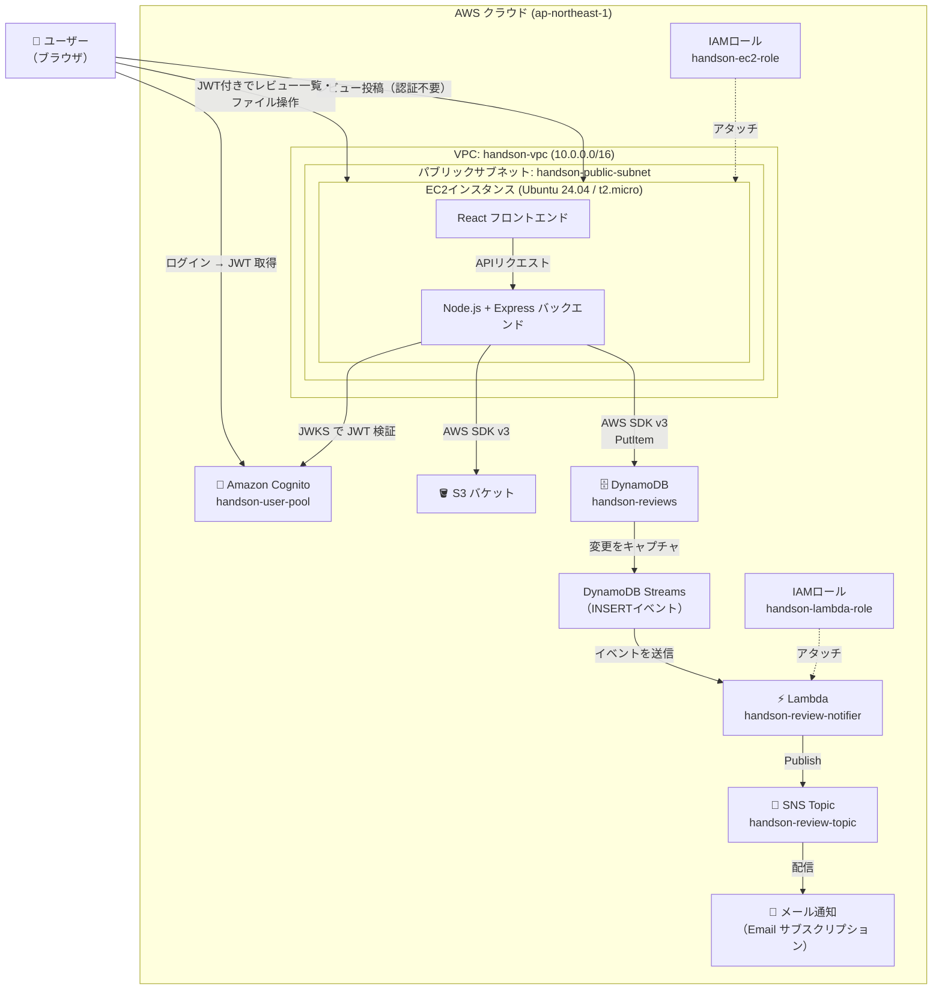
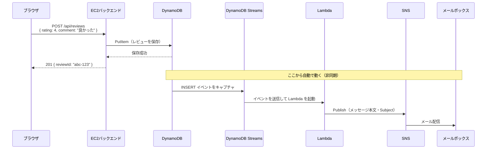

# Lambda + SNS セットアップ手順（Phase 4 ハンズオン）

作成日: 2026-05-10
更新日: 2026-05-10

対象: AWS未経験者向けハンズオン（4回目）

---
## 完成後イメージ


## 環境イメージ




## ゴール

レビューが投稿されると、登録したメールアドレスに通知メールが自動で届く仕組みを作る。

## 全体の流れ

```
[1] DynamoDB Streams を有効化
    ↓
[2] SNS トピックを作成・メールアドレスを登録
    ↓
[3] Lambda 用 IAM ロールを作成
    ↓
[4] Lambda 関数を作成・設定
    ↓
[5] DynamoDB Streams を Lambda のトリガーとして設定
    ↓
[6] ブラウザで動作確認
```

---

## AWS 用語集（手順を始める前に読んでおこう）

Phase 1〜3 の用語集に加えて、Phase 4 で新たに登場する言葉を解説する。

---

### DynamoDB Streams

#### DynamoDB Streams
DynamoDB テーブルへの変更（INSERT / MODIFY / REMOVE）をリアルタイムにキャプチャする機能。
変更内容を「ストリーム」として Lambda に渡すことができる。

```
レビュー投稿
    ↓ PutItem
DynamoDB（変更を記録）
    ↓ DynamoDB Streams
Lambda が自動起動
```

#### ストリームビューの種類

| 種類 | 内容 |
|------|------|
| KEYS_ONLY | 変更されたアイテムのキーのみ |
| NEW_IMAGE | 変更後のアイテム全体 ← 今回使う |
| OLD_IMAGE | 変更前のアイテム全体 |
| NEW_AND_OLD_IMAGES | 変更前・後の両方 |

---

### Lambda

#### AWS Lambda
サーバーを持たずにコードを実行できる「サーバーレス関数」。
コードをアップロードするだけで動作し、EC2 のようにサーバーの起動・管理が不要。

```
従来（EC2）: サーバーを立てて、24時間稼働させる
Lambda:      イベントが来たときだけコードが実行される
             → アイドル時の費用ゼロ
```

#### イベントソース
Lambda を起動するきっかけ。今回は DynamoDB Streams がイベントソース。
他に S3 ・ API Gateway・SQS などが使える。

#### ハンドラ
Lambda 関数のエントリーポイント（最初に呼ばれる関数）。
今回の Python コードでは `index.handler` を指定する（`index.py` の `handler` 関数）。

#### 環境変数
Lambda 関数内で使う設定値を外部から渡す仕組み。
今回は SNS トピックの ARN を環境変数 `SNS_TOPIC_ARN` として渡す。

#### 実行ロール
Lambda 関数が AWS サービスにアクセスするための IAM ロール。
EC2 の「インスタンスプロファイル」と同じ考え方。

---

### SNS

#### Amazon SNS（Simple Notification Service）
メッセージを複数の宛先に一斉配信するサービス（Pub/Sub モデル）。

```
[Lambda] →（Publish）→ [SNS トピック] →（配信）→ [Email]
                                                → [SMS]
                                                → [別の Lambda]
                                                → [HTTP エンドポイント]
```

#### トピック
SNS でメッセージを受け取る「チャンネル」。
メッセージを送る側（Lambda）はトピックに向けて送信し、
受け取る側（Email など）はトピックを「サブスクライブ」して受信する。

#### サブスクリプション
SNS トピックのメッセージを受け取るための登録。
今回はメールアドレスを登録する（Email プロトコル）。
登録後に確認メールが届くので、リンクをクリックして有効化する必要がある。

#### ARN（Amazon Resource Name）
AWS リソースを一意に識別する文字列。

```
例: arn:aws:sns:ap-northeast-1:123456789012:handson-review-topic
          ↑       ↑              ↑            ↑
       サービス  リージョン    アカウントID   リソース名
```

Lambda の環境変数に SNS トピックの ARN を設定するために使う。

---

### IAM

#### AWSLambdaDynamoDBExecutionRole
Lambda が DynamoDB Streams を読み取り、CloudWatch Logs にログを書き込むための管理ポリシー。
Lambda 用ロールに付与する。

#### AmazonSNSFullAccess
SNS のすべての操作を許可する管理ポリシー。
今回は Lambda から SNS にメッセージを送信するために使う。

> **本番環境では最小権限にすること**
> ハンズオンでは学習のため FullAccess を使うが、本番では
> 特定のトピックへの Publish のみに絞ったカスタムポリシーを使う。

---

## コード用語集（手順を始める前に読んでおこう）

---

### Lambda 関数の構造（Python）

```python
import boto3

sns = boto3.client('sns')  # SNS クライアントを作成

def handler(event, context):          # ← ハンドラ関数
    for record in event['Records']:   # ← DynamoDB Streams のレコードを1件ずつ処理
        if record['eventName'] != 'INSERT':
            continue  # INSERT（新規投稿）のみ処理する

        new_image = record['dynamodb']['NewImage']
        # ↑ DynamoDB の生の型形式: { 'rating': {'N': '4'}, 'comment': {'S': '良かった'} }

        rating    = new_image['rating']['N']    # 数値型は 'N' キー
        comment   = new_image['comment']['S']   # 文字列型は 'S' キー
        user_name = new_image['userName']['S']
```

#### DynamoDB Streams の型形式
DynamoDB Streams から届くデータは、`@aws-sdk/lib-dynamodb` (DocumentClient) を使わない
生の形式で届く。型を示すキー（`S`, `N`, `BOOL` など）を自分で指定して値を取り出す。

| DynamoDB型 | キー | 例 |
|-----------|-----|-----|
| 文字列 | `S` | `{ 'S': '田中' }` |
| 数値 | `N` | `{ 'N': '4' }` |
| 真偽値 | `BOOL` | `{ 'BOOL': True }` |
| Null | `NULL` | `{ 'NULL': True }` |

#### boto3
Python 用の AWS SDK。今回は `boto3.client('sns')` で SNS クライアントを作成し、
`sns.publish()` でメッセージを送信する。

---

## 仕組みの説明（学習者向け）



**ポイント:**
- レビュー投稿の HTTP レスポンスは DynamoDB 保存後にすぐ返る
- DynamoDB Streams → Lambda → SNS の流れは**非同期**で動く（投稿完了とは独立）
- Lambda はイベントが来たときだけ起動する（常時稼働ではない）

---

## [1] DynamoDB Streams を有効化

1. AWSマネジメントコンソール → 「DynamoDB」を開く
2. テーブル一覧から `handson-reviews` をクリック
3. 「エクスポートおよびストリーム」タブをクリック
4. 「DynamoDB ストリームの詳細」セクションの「有効化」をクリック
5. ストリームビューのタイプで **「新しいイメージ」** を選択
6. 「有効化」をクリック

> ストリームが有効になると「ストリームの ARN」が表示される。この ARN は後で Lambda のトリガー設定に使う（コンソールで自動選択できるため、メモしなくて OK）。

---

## [2] SNS トピックを作成・メールアドレスを登録

### トピックの作成

1. AWSマネジメントコンソール → 「SNS」を開く
2. 左メニュー「トピック」→「トピックの作成」をクリック
3. 以下を設定:

| 項目  | 設定値                    |
| --- | ---------------------- |
| タイプ | **スタンダード**             |
| 名前  | `handson-review-topic` |
| 表示名 | `ハンズオンレビュー通知`（任意）      |

4. 「トピックの作成」をクリック
5. 作成後に表示される **「ARN」** をコピーして手元にメモする

```
例: arn:aws:sns:ap-northeast-1:123456789012:handson-review-topic
```

### サブスクリプションの作成（メールアドレス登録）

1. 作成したトピックの詳細画面で「サブスクリプションの作成」をクリック
2. 以下を設定:

| 項目 | 設定値 |
|------|-------|
| プロトコル | **Email** |
| エンドポイント | 通知を受け取りたいメールアドレス |

3. 「サブスクリプションの作成」をクリック
4. 登録したメールアドレスに確認メールが届く
5. メール内の **「Confirm subscription」** リンクをクリックして有効化

> **確認メールが届かない場合:** 迷惑メールフォルダを確認する。送信元は `no-reply@sns.amazonaws.com`。

---

## [3] Lambda 用 IAM ロールを作成

1. AWSマネジメントコンソール → 「IAM」を開く
2. 左メニュー「ロール」→「ロールを作成」をクリック
3. 「信頼されたエンティティの種類」→「AWSのサービス」を選択
4. 「サービスまたはユースケース」で **「Lambda」** を選択
5. 「次へ」をクリック
6. 以下の 2 つのポリシーを検索してチェックを入れる:

| ポリシー名 | 目的 |
|-----------|------|
| `AWSLambdaDynamoDBExecutionRole` | DynamoDB Streams の読み取り + CloudWatch Logs への書き込み |
| `AmazonSNSFullAccess` | SNS へのメッセージ送信（Publish） |

7. 「次へ」をクリック
8. ロール名に `handson-lambda-role` と入力して「ロールを作成」をクリック

---

## [4] Lambda 関数を作成・設定

### 関数の作成

1. AWSマネジメントコンソール → 「Lambda」を開く
2. 「関数の作成」をクリック
3. 「一から作成」を選択し、以下を設定:

| 項目      | 設定値                                  |
| ------- | ------------------------------------ |
| 関数名     | `handson-review-notifier`            |
| ランタイム   | **Python 3.13**                      |
| アーキテクチャ | x86_64                               |
| 実行ロール   | 「既存のロールを使用する」→ `handson-lambda-role` |

4. 「関数の作成」をクリック

### コードをアップロード

1. 関数の詳細画面で「コードソース」セクションを確認
2. `lambda_function.py` の内容を全選択して削除
3. `phase04/lambda/index.py` の内容をコピーして貼り付ける
4. 画面上部の「Deploy」ボタンをクリック

### ハンドラの設定

1. 「コード」タブ → 「ランタイム設定」→「編集」をクリック
2. 「ハンドラ」の値を `lambda_function.lambda_handler` から **`lambda_function.handler`** に変更
3. 「保存」をクリック

## # タイムアウト値設定

1. 「設定」タブ → 「一般設定」→「編集」をクリック
2. 「タイムアウト」の値を `3秒` から **`30秒`** に変更
3. 「保存」をクリック

### 環境変数の設定

1. 「設定」タブ → 「環境変数」→「編集」をクリック
2. 「環境変数を追加」をクリック
3. 以下を入力:

| キー              | 値                        |
| --------------- | ------------------------ |
| `SNS_TOPIC_ARN` | [2] でコピーした SNS トピックの ARN |

4. 「保存」をクリック

---

## [5] DynamoDB Streams を Lambda のトリガーとして設定

1. Lambda 関数の詳細画面で「トリガーを追加」をクリック
2. 「ソースを選択」で **「DynamoDB」** を選択
3. 以下を設定:

| 項目 | 設定値 |
|------|-------|
| DynamoDB テーブル | `handson-reviews` |
| バッチサイズ | `1`（1レビューごとに通知） |
| 開始位置 | **「最新」**（新しいレコードのみ処理） |

4. 「追加」をクリック

> トリガーが追加されると、Lambda 関数の「設定」タブ → 「トリガー」に `DynamoDB` が表示される。

---

## [6] ブラウザで動作確認

### 動作確認チェックリスト

1. ブラウザで EC2 のアプリにアクセス:
   ```
   http://[EC2のパブリックIP]:3000
   ```

2. レビュー投稿フォームで実際にレビューを投稿する
   - 名前・評価・コメントを入力して「投稿する」をクリック
   - 「投稿しました」のメッセージが出ることを確認

3. 数分以内に登録したメールアドレスにメールが届くことを確認

**期待されるメール:**
```
件名: 【ハンズオンアプリ】新しいレビューが届きました

新しいレビューが投稿されました

名前: 田中
評価: ★★★★☆ (4/5)
コメント: とても良かったです

投稿日時: 2026-05-10T12:34:56.789Z
```

### Lambda 実行ログの確認

メールが届かない場合は Lambda のログを確認する:

1. Lambda 関数の詳細画面で「モニタリング」タブをクリック
2. 「CloudWatch Logs で表示」をクリック
3. 最新のログストリームをクリック
4. エラーメッセージが出ていないか確認する

---

## トラブルシューティング

### メールが届かない

**確認 1: サブスクリプションの確認が完了しているか**
- SNS コンソール → トピック → `handson-review-topic` → 「サブスクリプション」タブを確認
- ステータスが「確認済み」になっているか確認（「確認保留中」の場合は確認メールのリンクをクリック）

**確認 2: Lambda のトリガーが有効になっているか**
- Lambda コンソール → `handson-review-notifier` → 「設定」タブ → 「トリガー」
- DynamoDB トリガーが「有効」になっているか確認

**確認 3: Lambda の実行ログにエラーがないか**
- Lambda コンソール → 「モニタリング」→ 「CloudWatch Logs で表示」
- エラーがある場合はメッセージを確認する

---

### Lambda のログに `KeyError: 'SNS_TOPIC_ARN'` が出る

環境変数が設定されていない。

- Lambda コンソール → 「設定」タブ → 「環境変数」→「編集」
- `SNS_TOPIC_ARN` の値が正しく設定されているか確認する

---

### Lambda のログに `AuthorizationError` が出る

Lambda の実行ロールに SNS への権限がない。

- IAM コンソール → ロール → `handson-lambda-role`
- `AmazonSNSFullAccess` がアタッチされているか確認する

---

### Lambda のログに `ResourceNotFoundException` が出る

SNS トピックの ARN が間違っている可能性がある。

- SNS コンソール → 「トピック」→ `handson-review-topic` の ARN を再確認する
- Lambda の環境変数 `SNS_TOPIC_ARN` の値と一致しているか確認する

---

## ハンズオン終了時の注意

| リソース | 対応 |
|---------|------|
| EC2 | 停止（課金停止）|
| Lambda | 削除不要（リクエストがなければ費用ゼロ）|
| SNS | 削除不要（100万リクエスト/月まで無料）|
| DynamoDB Streams | テーブルが存在する限り有効のまま（追加費用は微小）|

> DynamoDB Streams は読み取りリクエスト数に応じて課金されるが、学習用途では無視できる金額（月数円以下）。
