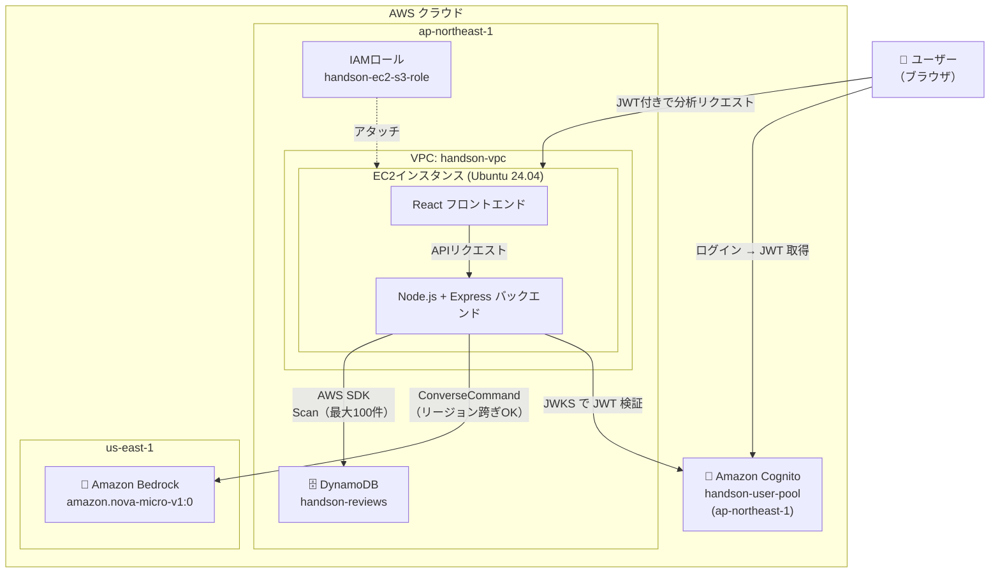
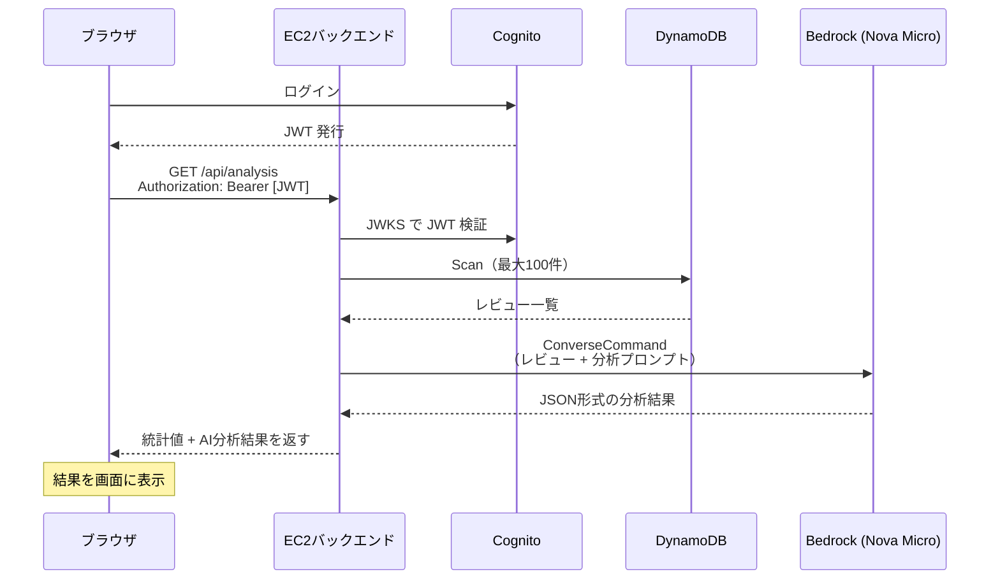

# Bedrock セットアップ手順（Phase 5 ハンズオン）

作成日: 2026-05-10
更新日: 2026-05-10

対象: AWS未経験者向けハンズオン（5回目）

---

## 環境イメージ



## ゴール

ログイン済みユーザーが「分析する」ボタンを押すと、DynamoDB のレビューデータを Amazon Nova Micro が分析し、全体傾向・好評点・改善要望が画面に表示される。

## 全体の流れ

```
[1] Bedrock モデルアクセスを有効化
    ↓
[2] IAMロールに Bedrock 権限を追加
    ↓
[3] バックエンドの .env 設定
    ↓
[4] EC2でアプリを更新・起動
    ↓
[5] ブラウザで動作確認
```

---

## AWS 用語集（手順を始める前に読んでおこう）

Phase 1〜4 の用語集に加えて、Phase 5 で新たに登場する言葉を解説する。

---

### Amazon Bedrock

#### Amazon Bedrock
様々な生成AIモデルをAPIで利用できるフルマネージドサービス。
モデル自体のインフラ管理は不要で、APIを呼ぶだけで生成AIを使える。

```
EC2バックエンド
    ↓ ConverseCommand（AWS SDK）
Amazon Bedrock（モデルを実行）
    ↓ テキスト応答
EC2バックエンド → フロントエンドに返す
```

#### Amazon Nova Micro
AWS が開発した生成AIモデルファミリー「Amazon Nova」の中で最も安価なモデル。
テキスト入出力のみ対応。今回のレビュー分析のように、テキストの要約・分類に適している。

```
Nova ファミリーの比較（2026年時点）:
  Nova Micro: テキストのみ・最安値 ← 今回使う
  Nova Lite:  テキスト + 画像・低コスト
  Nova Pro:   テキスト + 画像・高性能
```

料金（目安）: 入力 $0.000035/1,000トークン、出力 $0.00014/1,000トークン
→ 100件のレビューを分析しても約 $0.0003（0.05円以下）

#### モデルアクセス
Bedrock のモデルを使うには、事前に「モデルアクセス」のリクエストが必要。
無料で申請できるが、コンソールでの有効化操作が必要。

#### ConverseCommand
AWS SDK が提供する、複数のモデルに対して統一的なインターフェースでリクエストを送れる API。
モデルごとに異なるリクエスト形式を吸収してくれる。

#### トークン
AIモデルがテキストを処理する最小単位。
日本語は1文字が1〜2トークン程度。料金はトークン数で計算される。

---

### リージョンについて

#### なぜ us-east-1 を使うのか
Amazon Nova Micro は現時点で `us-east-1`（バージニア北部）で提供されている。
EC2 は `ap-northeast-1`（東京）にあるが、AWS SDK はリージョンをまたいで呼び出せる。
今回のアプリでは、DynamoDB/S3/Cognito は東京、Bedrock だけバージニアを使う。

```
EC2（東京）
  ├─→ DynamoDB（東京）  ← AWS_REGION=ap-northeast-1
  ├─→ S3（東京）        ← AWS_REGION=ap-northeast-1
  └─→ Bedrock（バージニア）← BEDROCK_REGION=us-east-1
```

---

## コード用語集（手順を始める前に読んでおこう）

---

### Bedrock SDK の呼び出し方

```typescript
import { BedrockRuntimeClient, ConverseCommand } from '@aws-sdk/client-bedrock-runtime'

// Bedrockクライアント（us-east-1 を指定）
const bedrock = new BedrockRuntimeClient({ region: 'us-east-1' })

const command = new ConverseCommand({
  modelId: 'amazon.nova-micro-v1:0',
  messages: [
    { role: 'user', content: [{ text: 'ここにプロンプト' }] }
  ],
  inferenceConfig: {
    maxTokens: 1024,   // 最大出力トークン数
    temperature: 0.3,  // 低いほど出力が安定する（0.0〜1.0）
  },
})

const response = await bedrock.send(command)
const text = response.output?.message?.content?.[0]?.text ?? ''
```

#### temperature（温度パラメータ）
AIの出力のランダム性を制御するパラメータ。
- `0.0` に近い: 毎回ほぼ同じ、安定した出力（分析・要約に向く）
- `1.0` に近い: 毎回異なる、創造的な出力（文章生成に向く）
今回は `0.3`（安定寄り）を使う。

---

## 仕組みの説明（学習者向け）



**ポイント:**
- DynamoDB Scan → Bedrock 呼び出しの順に処理される（同期）
- Bedrockの応答には数秒かかるため、フロントエンドに「分析中...」の表示がある
- Bedrockはリクエストのたびに課金されるが、1回あたり0.05円以下

---

## [1] Bedrock モデルアクセスを有効化

Amazon Bedrock のモデルは、最初に「アクセスを有効化」する操作が必要。

1. AWSマネジメントコンソール → 「Amazon Bedrock」を開く
   - リージョンを **「米国東部（バージニア北部）us-east-1」** に切り替える
2. 左メニュー「モデルアクセス」をクリック
3. 「モデルアクセスを変更」または「利用可能なモデル」から **「Amazon Nova Micro」** を探す
4. チェックボックスをオンにして「次へ」→「送信」
5. ステータスが「アクセス権限が付与されました」になるまで待つ（通常即時）

> **リージョン確認:** Bedrock の操作は必ず `us-east-1` で行う。東京リージョンで操作しても Nova Micro は表示されない。

---

## [2] IAMロールに Bedrock 権限を追加

Phase 1 で作成した `handson-ec2-s3-role` に Bedrock へのアクセス権限を追加する。

1. AWSマネジメントコンソール → 「IAM」を開く
   - リージョンは **東京（ap-northeast-1）** に戻しておく（IAMはグローバルサービスのため実際はどこでもOK）
2. 左メニュー「ロール」→ `handson-ec2-s3-role` をクリック
3. 「許可を追加」→「ポリシーをアタッチ」
4. 検索欄に `AmazonBedrockFullAccess` と入力
5. `AmazonBedrockFullAccess` にチェックを入れて「許可を追加」

> **本番環境では最小権限にすること**
> ハンズオンでは FullAccess を使うが、本番では特定のモデルへの呼び出しのみに絞ったカスタムポリシーを使う。

---

## [3] バックエンドの .env 設定

**まず EC2 に SSH 接続し、root に切り替えて最新コードを取得する:**

```bash
sudo su -
cd ~/samurai-repo
git pull
```

`phase05/` フォルダが表示されれば取得成功。

**実行場所: `~/samurai-repo/phase05/backend`**

```bash
cd ~/samurai-repo/phase05/backend
cp .env.example .env
nano .env
```

以下のように書き換える（Cognito・S3・DynamoDB の値は Phase 3 と同じ）:

```
S3_BUCKET_NAME=handson-yamada-files
COGNITO_USER_POOL_ID=ap-northeast-1_xxxxxxxx
COGNITO_CLIENT_ID=xxxxxxxxxxxxxxxxxxxxxxxxxx
DYNAMODB_TABLE_NAME=handson-reviews
BEDROCK_REGION=us-east-1
```

保存して終了: `Ctrl + O` → `Enter` → `Ctrl + X`

フロントエンドの .env も設定する:

```bash
cd ~/samurai-repo/phase05/frontend
cp .env.example .env
nano .env
```

```
VITE_COGNITO_USER_POOL_ID=ap-northeast-1_xxxxxxxx
VITE_COGNITO_CLIENT_ID=xxxxxxxxxxxxxxxxxxxxxxxxxx
```

保存して終了: `Ctrl + O` → `Enter` → `Ctrl + X`

---

## [4] EC2でアプリを更新・起動

**実行場所: `~/samurai-repo`**（[3] の続き。すでに root かつ git pull 済みの前提）

```bash
cd ~/samurai-repo

# フロントエンドをビルド
cd phase05/frontend
npm install
npm run build

# バックエンドをセットアップ・起動
cd ../backend
npm install
npm run build
npm start
```

以下のように表示されれば起動成功:

```
サーバー起動: http://localhost:3000
S3バケット: handson-yamada-files
DynamoDBテーブル: handson-reviews
Bedrockリージョン: us-east-1
```

---

## [5] ブラウザで動作確認

ブラウザで以下にアクセス:

```
http://[EC2のパブリックIP]:3000
```

### 動作確認チェックリスト

**前提: レビューが数件以上投稿されている**

- [ ] ログインするとナビゲーションに「AI分析」タブが表示される
- [ ] 「AI分析」タブをクリックすると分析ページが開く
- [ ] 「分析する」ボタンを押すと「分析中...」の表示に変わる
- [ ] 数秒後に以下が表示される:
  - 概要カード（レビュー件数・平均評価）
  - 評価分布バーグラフ（★5〜★1の件数）
  - 全体傾向テキスト（Nova Micro 生成）
  - 好評点 TOP3（緑のリスト）
  - 改善要望 TOP3（オレンジのリスト）
  - 分析日時
- [ ] 未ログイン状態で「AI分析」をクリックするとログイン画面に遷移する

---

## トラブルシューティング

### 「AI分析に失敗しました」が表示される

バックエンドのターミナルに `[Bedrock Error]` が出ている場合の確認事項:

**確認 1: モデルアクセスが有効か**
- Bedrock コンソール（us-east-1）→「モデルアクセス」
- `Amazon Nova Micro` のステータスが「アクセス権限が付与されました」か確認

**確認 2: IAMロールに権限があるか**
- IAM コンソール → ロール → `handson-ec2-s3-role`
- `AmazonBedrockFullAccess` がアタッチされているか確認

**確認 3: `.env` の `BEDROCK_REGION` が正しいか**
```bash
cat ~/samurai-repo/phase05/backend/.env | grep BEDROCK
# → BEDROCK_REGION=us-east-1 と表示されるはず
```

---

### 分析結果が文字化けする / 空になる

Bedrock の応答が JSON 形式でない場合に発生することがある。
バックエンドのターミナルに表示される生の応答を確認する:

```bash
# ターミナルのログを確認
# [Bedrock Error] と出ている場合はエラーの詳細を確認する
```

レビューが 0 件の場合は「まだレビューがありません」と表示されるため、先にレビューを数件投稿してから試す。

---

## ハンズオン終了時の注意

EC2を停止する手順は Phase 1 と同じ。
Bedrock はリクエスト課金のため、停止不要（API を呼ばなければ費用ゼロ）。
