# ALB + Auto Scaling セットアップ手順（Phase 6 ハンズオン）

作成日: 2026-05-23

対象: AWS未経験者向けハンズオン（6回目）

---

## 完成後イメージ

```
[ブラウザ]
    ↓ http://[ALBのDNS名]（ポート80）
[ALB: handson-alb]
    ├─→ EC2 (ap-northeast-1a) ← AMI から自動起動
    └─→ EC2 (ap-northeast-1c) ← AMI から自動起動
           ↓
    [DynamoDB / S3 / Cognito / Bedrock]（Phase 5 から変更なし）
```

---

## 環境イメージ

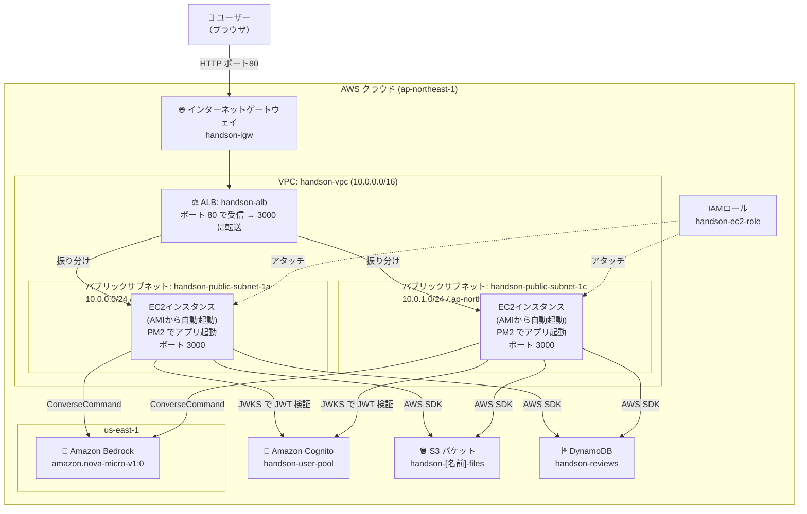

---

## ゴール

Phase 5 まで「1台のEC2」で動かしていたアプリを、複数のEC2で同時に動かす構成に変える。
1台が突然止まっても残りのEC2でアプリが動き続けられるようにすること、これを**冗長化**という。
ALBがアクセスを振り分け、Auto Scalingが負荷に応じてEC2台数を自動で増減させる構成を体験する。

---

## 全体の流れ

```
[1] サブネットを追加作成（AZ-c 用）
    ↓
[2] EC2 に PM2 をインストールして自動起動設定
    ↓
[3] AMI（マシンイメージ）を作成
    ↓
[4] ターゲットグループを作成
    ↓
[5] ALB（Application Load Balancer）を作成
    ↓
[6] Launch Template を作成
    ↓
[7] Auto Scaling グループを作成
    ↓
[8] ブラウザで動作確認
    ↓
[9] （後片付け）リソースの削除
```

---

## AWS 用語集（手順を始める前に読んでおこう）

---

### 今回のテーマ：なぜ1台では危ないのか

Phase 1〜5 では EC2 が1台しかいない。このEC2が突然止まると、アプリ全体がダウンする。

```
【現状】
ブラウザ → EC2（1台）→ DynamoDB / S3
            ↑ここが止まると全滅

【Phase 6 以降】
ブラウザ → ALB → EC2-A（AZ-a）→ DynamoDB / S3
                → EC2-C（AZ-c）→ DynamoDB / S3
↑1台止まっても ALB が別の EC2 にアクセスを振り分ける
```

---

### アベイラビリティゾーン（AZ）

AWS のリージョン（例: 東京）の中にある、物理的に別の場所にあるデータセンターのグループ。
東京リージョンには `ap-northeast-1a`・`1c`・`1d` の3つの AZ がある。

```
東京リージョン (ap-northeast-1)
  ├─ AZ-a (ap-northeast-1a) ← 建物A（例: 江東区）
  ├─ AZ-c (ap-northeast-1c) ← 建物C（例: 港区）
  └─ AZ-d (ap-northeast-1d) ← 建物D（例: 新宿区）
```

建物の場所が違うので、AZ-a で火災・停電が起きても AZ-c のEC2は動き続ける。
今回は AZ-a と AZ-c の2つにEC2を1台ずつ置くことで、片方が停止しても動き続けられる構成にする。

---

### サブネット（Subnet）

VPC 内を分割した小さなネットワーク。AZ ごとに1つ作成する。
今回は AZ-a 用と AZ-c 用の2つを用意する。

| サブネット名 | CIDR | AZ | 役割 |
|------------|------|----|------|
| handson-public-subnet-1a | 10.0.0.0/24 | ap-northeast-1a | Phase 1 で作成済み |
| handson-public-subnet-1c | 10.0.1.0/24 | ap-northeast-1c | Phase 6 で新規作成 |

> **CIDRの番号が違う理由:**
> 1つのサブネットに割り当てるIPアドレスの範囲は、別のサブネットと重複できない。
> `10.0.0.0/24` は「10.0.0.1〜10.0.0.254」の範囲、`10.0.1.0/24` は「10.0.1.1〜10.0.1.254」の範囲なので、
> 番号を1つずらすことで重複しない2つの範囲を確保している。

---

### ルートテーブル（Phase 1 の復習）

「このIPアドレス宛の通信はどこへ送るか」を定義した経路表。
Phase 1 で `0.0.0.0/0 → インターネットゲートウェイ`（= すべての宛先はインターネットへ）というルールを作成した。

新しいサブネットを作成しただけでは、このルートテーブルとの関連付けが行われていない。
関連付けがないと「インターネットに出るにはどこへ行けばよいか」が分からず、外部と通信できない。
手順 [1-4] でこの関連付けを行う。

```
handson-public-subnet-1c（新しいサブネット）
  ↓ ルートテーブルを関連付け
handson-rtb（0.0.0.0/0 → handson-igw）
  ↓ これでインターネットに出られるようになる
インターネット
```

---

### AMI（Amazon Machine Image）

EC2インスタンスの「スナップショット（写真）」。
OS・インストール済みソフト・設定ファイルがそのまま保存される。
AMIから新しいEC2を起動すると、スナップショット時点の状態で立ち上がる。

```
既存EC2（Phase 5 まで設定済み）
  ↓ AMI 作成（写真を撮る）
AMI（イメージ）
  ↓ ここから複数の EC2 を起動できる
EC2-A（AZ-a）、EC2-C（AZ-c）...
```

---

### ポート

1台のサーバー（EC2）は複数のアプリを同時に動かせる。
どのアプリ宛の通信かを区別するための「窓口番号」がポートである。

今回は2種類のポートが登場する：

| ポート番号 | 役割 |
|-----------|------|
| **80** | ALB がブラウザからアクセスを受け付ける窓口。HTTP の標準ポートなのでURLにポート番号を書かずに済む |
| **3000** | EC2 上のアプリが動いている窓口。ALB から転送されたアクセスはここで受け取る |

```
ブラウザ → ALB（ポート80で受付）→ EC2（ポート3000に転送）→ アプリ
```

ブラウザからは「ポート80のALB」にアクセスするだけでよく、3000番を意識しなくてよい。

---

### ALB（Application Load Balancer）

複数のEC2にアクセスを振り分ける「交通整理役」。
ブラウザからのアクセスを受け取り、正常に動いているEC2に順番に振り分ける。

- **ヘルスチェック**: 数十秒ごとに各EC2の `/`（トップページ）へアクセスし、正常に応答するか確認する。応答がないEC2には振り分けを停止する。
- **ラウンドロビン**: 複数のEC2に対して1台ずつ順番に振り分ける方式。EC2-A・EC2-C・EC2-A・EC2-C…と交互に割り振られる。
- **マルチAZ対応**: 複数の AZ にまたがって配置できるため、1つの AZ が停止しても別の AZ のEC2でアプリが動き続ける。

---

### ターゲットグループ

ALBが「どのEC2に振り分けるか」を管理するグループ。
ALBに直接EC2を登録するのではなく、一度ターゲットグループにEC2を登録し、ALBはターゲットグループを宛先として指定する。

```
ALB → ターゲットグループ（handson-tg）
         ├─ EC2-A（healthy: 正常）← ここに振り分ける
         └─ EC2-C（healthy: 正常）← ここにも振り分ける
                                    （unhealthy になったら自動で外す）
```

こうすることで、Auto Scaling が EC2 を追加・削除しても、ALB 側の設定を変えずに柔軟に対応できる。

---

### Auto Scaling グループ（ASG）

EC2の台数を自動で増減させる仕組み。

| 設定 | 意味 |
|------|------|
| 最小台数（Min） | 常に動かし続ける最低台数 |
| 希望台数（Desired） | 通常時の台数 |
| 最大台数（Max） | 増やせる上限台数 |

アクセスが増えて負荷が高くなると台数を自動で増やし（**スケールアウト**）、アクセスが減って負荷が下がると台数を自動で減らす（**スケールイン**）。

```
【スケールアウト：負荷が増えたとき】
EC2 × 2台 → EC2 × 3台 → EC2 × 4台

【スケールイン：負荷が落ち着いたとき】
EC2 × 4台 → EC2 × 3台 → EC2 × 2台
```

---

### Launch Template（起動テンプレート）

ASGが新しいEC2を起動するときの「設計図」。
AMI・インスタンスタイプ・セキュリティグループ・IAMロールなどをあらかじめ登録しておく。

---

### PM2

起動したアプリを管理・監視するソフト。
通常 `npm start` でアプリを起動すると、ターミナルを閉じたときやサーバーが再起動したときにアプリも止まってしまう。
PM2 を使うと、以下のことが自動で行われる：

- **EC2 起動時にアプリを自動で起動する**（ターミナルを開かなくてよい）
- **アプリが異常終了したとき自動で再起動する**

AMI から起動した EC2 でもアプリが自動起動するよう、AMI 作成前に PM2 の設定を行う。

---

## [1] サブネットを追加作成（AZ-c 用）

Phase 1 では AZ-a（ap-northeast-1a）にサブネットを1つ作成した。
ALB はマルチAZ構成が必須なので、AZ-c（ap-northeast-1c）用のサブネットを追加する。

### 1-1. VPC コンソールを開く

1. AWSマネジメントコンソール → 「VPC」を開く
2. リージョンが **東京（ap-northeast-1）** になっていることを確認

### 1-2. 既存サブネットの確認

1. 左メニュー「サブネット」→ `handson-public-subnet` を確認
2. 「アベイラビリティゾーン」が `ap-northeast-1a`、CIDR が `10.0.0.0/24` であることを確認

> **名前の変更（任意）:**
> 混乱を避けるために `handson-public-subnet` を `handson-public-subnet-1a` に変更しておくと分かりやすい。
> サブネット名を選択 → 鉛筆アイコン → 名前を変更 → 保存

### 1-3. 新しいサブネットを作成（AZ-c 用）

1. 「サブネットを作成」をクリック
2. 以下を設定:

| 項目 | 値 |
|------|-----|
| VPC ID | `handson-vpc` を選択 |
| サブネット名 | `handson-public-subnet-1c` |
| アベイラビリティゾーン | **ap-northeast-1c** |
| IPv4 CIDR ブロック | `10.0.1.0/24` |

3. 「サブネットを作成」をクリック

### 1-3-2. パブリックIP自動割り当てを有効化する

サブネット作成直後はパブリックIPの自動割り当てが**無効**になっている。このままだとEC2にパブリックIPが付かず、インターネットに出られないためCognitoへのJWT検証が失敗して401エラーになる。

1. 作成した `handson-public-subnet-1c` を選択
2. 「アクション」→ **「サブネットの設定を編集」**
3. **「パブリックIPv4アドレスの自動割り当てを有効化」** にチェック → 保存

> **なぜ必要か:**
> このアプリはJWT検証のためにEC2から外部のCognitoエンドポイント（`cognito-idp.ap-northeast-1.amazonaws.com`）にHTTPS通信を行う。
> パブリックIPがないとインターネットに出られず、JWT検証が失敗して全APIが401になる。
> S3・DynamoDB・Bedrockへの通信も同様に失敗する。

### 1-4. 新しいサブネットをルートテーブルに関連付ける

新しいサブネットにもインターネットゲートウェイへのルートが必要。

1. 左メニュー「ルートテーブル」→ `handson-rtb`（または `handson-public-subnet` に関連付けられているルートテーブル）を選択
2. 「サブネットの関連付け」タブ → 「サブネットの関連付けを編集」
3. `handson-public-subnet-1c` にチェックを追加 → 「保存」

> **確認:** ルートテーブルに `0.0.0.0/0 → handson-igw` のルートがあることを確認する。
> これがないと、新しいサブネットからインターネットに出られない。

---

## [2] EC2 に PM2 をインストールして自動起動設定

AMI を作成する前に、EC2 起動時にアプリが自動で立ち上がるよう設定する。

### 2-1. EC2 に SSH 接続

```bash
ssh -i [キーペアファイル] ubuntu@[EC2のパブリックIP]
sudo su -
```

### 2-2. 現在動いているアプリを停止

```bash
# npm start で動かしている場合はプロセスを確認して kill
ps aux | grep node
kill [プロセスID]
```

### 2-3. PM2 をインストール

```bash
npm install -g pm2
```

### 2-4. アプリを PM2 で起動

```bash
cd ~/samurai-repo/phase05/backend
pm2 start npm --name "handson-app" -- start
```

起動確認:
```bash
pm2 list
# ステータスが "online" になっていれば成功
```

### 2-5. PM2 の自動起動設定（EC2 再起動時も自動起動）

**① systemd への自動起動登録を行う**

```bash
pm2 startup
# ↑ 実行すると systemd へのサービス登録が自動で行われる
# 最後に「$ pm2 save」と表示されたら成功
```

**② 現在の PM2 プロセス状態を保存する（次回 EC2 起動時に自動復元される）**

```bash
pm2 save
```

### 2-6. ブラウザで動作確認

```
http://[EC2のパブリックIP]:3000
```

ログインできてアプリが正常に動いていれば OK。

---

## [3] AMI（マシンイメージ）を作成

現在の EC2 の状態をスナップショットとして保存する。

1. AWSマネジメントコンソール → 「EC2」を開く
2. 左メニュー「インスタンス」→ 動作中の EC2 インスタンスを選択
3. 「アクション」→「イメージとテンプレート」→「イメージを作成」
4. 以下を設定:

| 項目 | 値 |
|------|-----|
| イメージ名 | `handson-app-ami` |
| イメージの説明 | end-phase05-after-pm2 |
| 再起動しない | チェックなし（デフォルトのまま） |
| タグ | Name: `handson-app-ami` |

5. 「イメージを作成」をクリック

> **AMI の作成には数分かかる。**
> 左メニュー「AMI」を開き、ステータスが「available」になるまで待つ。

---

## [4] ターゲットグループを作成

ALB がリクエストを送る宛先グループを作る。

1. EC2 コンソール → 左メニュー「ターゲットグループ」→「ターゲットグループの作成」
2. 以下を設定:

| 項目 | 値 |
|------|-----|
| ターゲットタイプ | インスタンス |
| ターゲットグループ名 | `handson-tg` |
| プロトコル | HTTP |
| ポート | **3000** |
| VPC | `handson-vpc` |
| ヘルスチェックパス | `/` |
| ヘルスチェック正常のしきい値 | 2 |
| ヘルスチェック間隔 | 30秒 |

3. 「次へ」→「ターゲットグループの作成」（この時点でEC2は登録しない）

> **ポートを 3000 にする理由:**
> アプリは 3000 番ポートで動いている。ALB はポート 80 でリクエストを受け取り、3000 番に転送する。

---

## [5] ALB（Application Load Balancer）を作成

### 5-1. ALB を作成

1. EC2 コンソール → 「ロードバランサー」→「ロードバランサーの作成」
2. 「Application Load Balancer」を選択 → 「作成」
3. 以下を設定:

**基本設定**

| 項目 | 値 |
|------|-----|
| 名前 | `handson-alb` |
| スキーム | インターネット向け |
| IP アドレスタイプ | IPv4 |

**ネットワークマッピング**

| 項目 | 値 |
|------|-----|
| VPC | `handson-vpc` |
| アベイラビリティゾーン（1つ目） | `ap-northeast-1a` → `handson-public-subnet-1a` を選択 |
| アベイラビリティゾーン（2つ目） | `ap-northeast-1c` → `handson-public-subnet-1c` を選択 |

> **2つのAZを選ぶ理由:**
> ALB はマルチAZ構成が必須。1つのAZが障害になっても、もう1つのAZで継続できる。

**セキュリティグループ**

「新しいセキュリティグループを作成」を選択:

| 項目 | 値 |
|------|-----|
| 名前 | `handson-alb-sg` |
| インバウンドルール | HTTP / ポート 80 / ソース: `0.0.0.0/0` |

**リスナーとルーティング**

| 項目 | 値 |
|------|-----|
| プロトコル | HTTP |
| ポート | 80 |
| デフォルトアクション | `handson-tg` に転送 |

4. 「ロードバランサーの作成」をクリック
作成されたALBのリソースマップを押下する。
リスナー → ルール → ターゲットグループ迄線が引かれており、紐づけがされていることを確認する
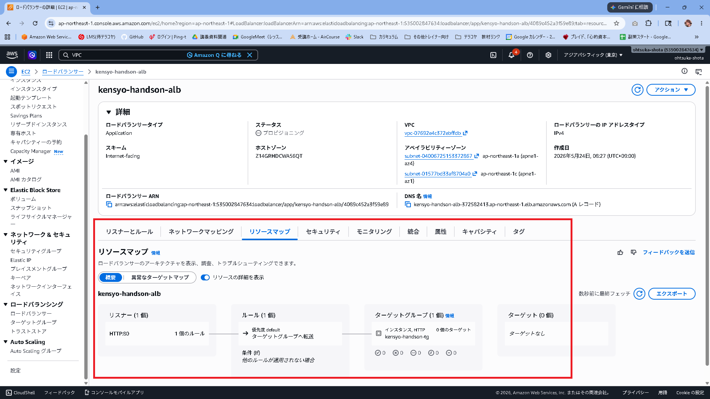

### 5-2. EC2 のセキュリティグループに ALB からのアクセスを許可

ALB から EC2 の 3000 番ポートへのアクセスを許可する。

1. EC2 コンソール → 「セキュリティグループ」
2. EC2 に設定されている `handson-sg` を選択
3. 「インバウンドルールを編集」→「ルールを追加」

| 項目 | 値 |
|------|-----|
| タイプ | カスタム TCP |
| ポート範囲 | 3000 |
| ソース | `handson-alb-sg`（ALBのSGをドロップダウンから選択） |

4. 「ルールを保存」

ポートが3000でソースが0.0.0.0/0とsg-*のものの2つがある状態となる。
ALBとEC2を紐づけ出来たら、0.0.0.0/0の方を外してみると勉強になるだろう。
ALB経由→通信〇
EC2直接→通信×
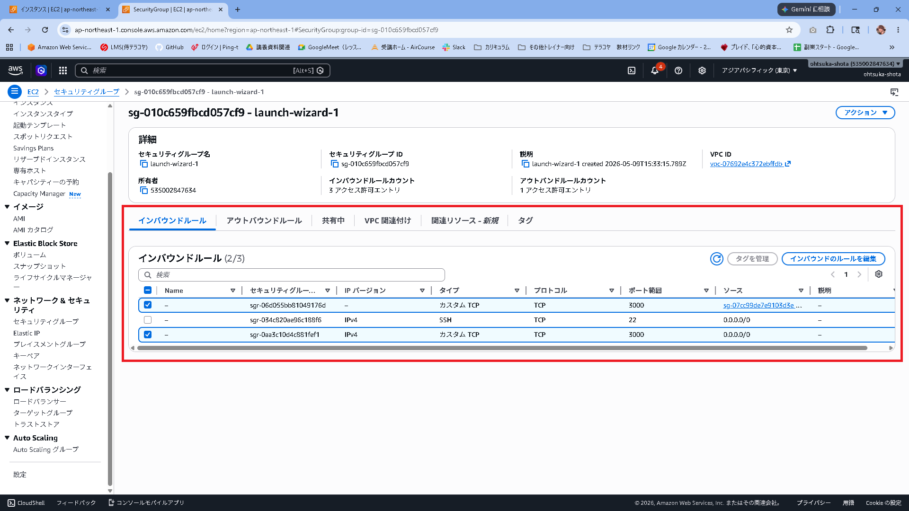

---

## [6] Launch Template を作成

Auto Scaling グループが EC2 を起動するときの設計図を作る。

1. EC2 コンソール → 「起動テンプレート」→「起動テンプレートを作成」
2. 以下を設定:

| 項目 | 値 |
|------|-----|
| 起動テンプレート名 | `handson-lt` |
| AMI | [3] で作成した `handson-app-ami` を選択 |
| インスタンスタイプ | `t2.micro`（無料枠対象） |
| キーペア | 既存のキーペアを選択 |
| セキュリティグループ | `handson-ec2-sg`（既存のEC2と同じもの） |

**高度な詳細**

| 項目 | 値 |
|------|-----|
| IAM インスタンスプロファイル | `handson-ec2-role` |

> **IAMロールを指定する理由:**
> AMI から起動した EC2 にも DynamoDB/S3/Bedrock へのアクセス権限が必要。

3. 「起動テンプレートを作成」

---

## [7] Auto Scaling グループを作成

1. EC2 コンソール → 「Auto Scaling グループ」→「Auto Scaling グループを作成」

### ステップ 1：起動テンプレートを選択

| 項目 | 値 |
|------|-----|
| 名前 | `handson-asg` |
| 起動テンプレート | `handson-lt` |

### ステップ 2：ネットワーク設定

| 項目 | 値 |
|------|-----|
| VPC | `handson-vpc` |
| アベイラビリティゾーンとサブネット | `handson-public-subnet-1a` と `handson-public-subnet-1c` の両方を選択 |

### ステップ 3：ロードバランシング設定

| 項目 | 値 |
|------|-----|
| ロードバランシング | 既存のロードバランサーにアタッチ |
| ターゲットグループ | `handson-tg` |
| ヘルスチェックのタイプ | **ELB**（ALBのヘルスチェックを使う） |

### ステップ 4：グループサイズとスケーリング

| 設定 | 値 | 意味 |
|------|-----|------|
| 希望する容量 | 2 | 通常時 2 台起動 |
| 最小容量 | **2** | スケールインで減らせる下限を 2 台に固定 |
| 最大容量 | 4 | 最大 4 台まで増やせる |

> **最小容量を 2 にする理由:**
> スケーリングポリシー（CPU監視）を設定すると、トラフィックがない学習環境では CPU 使用率がほぼ 0% になり、「CPU が低すぎる → 台数を減らせ（AlarmLow）」が常に発火してしまう。
> 最小容量を 2 にすることで、スケールインが発火しても 2 台より減らなくなる。
> 最小容量を 1 のままにすると、スケーリングポリシーが自動で Desired を 1 に下げ続けるため、2 台維持できない。

**スケーリングポリシー（任意）:**
- 「ターゲット追跡スケーリングポリシー」を選択
- メトリクス: 「平均 CPU 使用率」
- ターゲット値: 50

> CPU が 50% を超えたら自動でEC2を追加し、下がったら削除する設定。
> 学習環境では常に CPU が低いため、最小容量が 1 だとスケールインが繰り返し発火して 1 台に戻され続ける。最小容量 2 で防ぐ。

### ステップ 5：タグ設定

| キー | 値 |
|------|----|
| Name | `handson-asg-instance` |

タグを設定しておくと、ASGが起動した EC2 を一覧で識別しやすくなる。

### ステップ 6：確認 → 作成

「Auto Scaling グループを作成」をクリック。

> **EC2 が自動起動される。**
> 「インスタンス」の一覧に `handson-asg-instance` という名前のEC2が2台表示されれば成功。

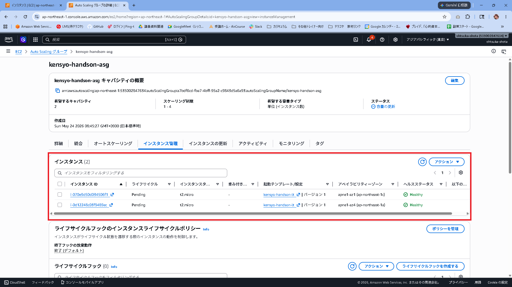
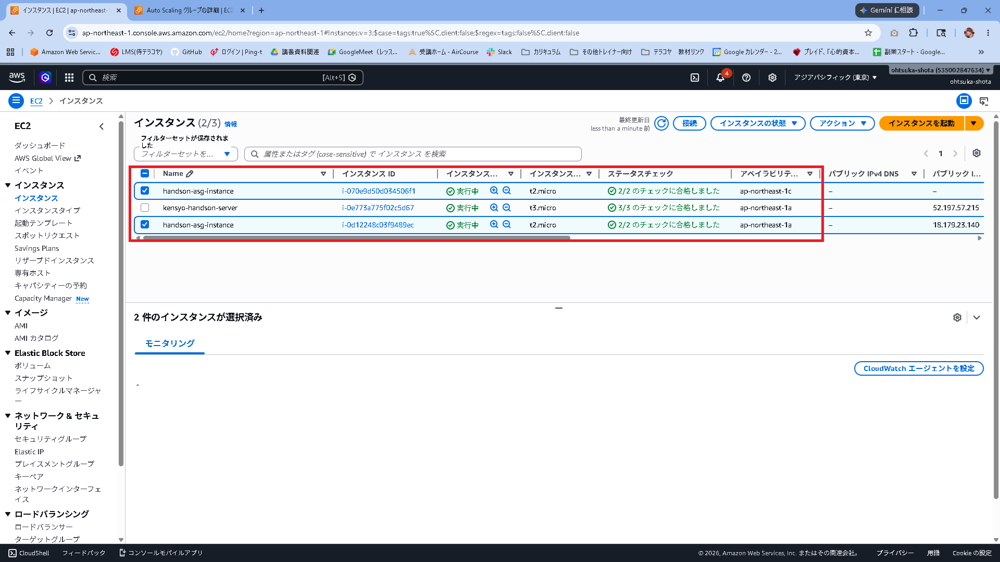

---

## [8] ブラウザで動作確認

### 8-1. ALB の DNS 名を確認

1. EC2 コンソール → 「ロードバランサー」→ `handson-alb` を選択
2. 「詳細」タブ → **「DNS 名」** をコピー

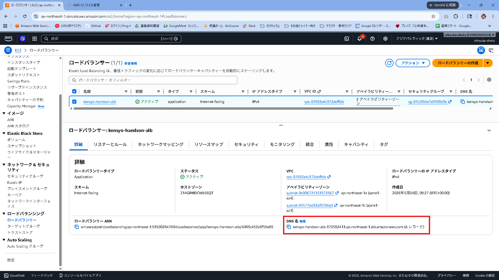

リソースマップもこのタイミングで確認しよう。
ターゲットに2つのEC2が表示されているはず。

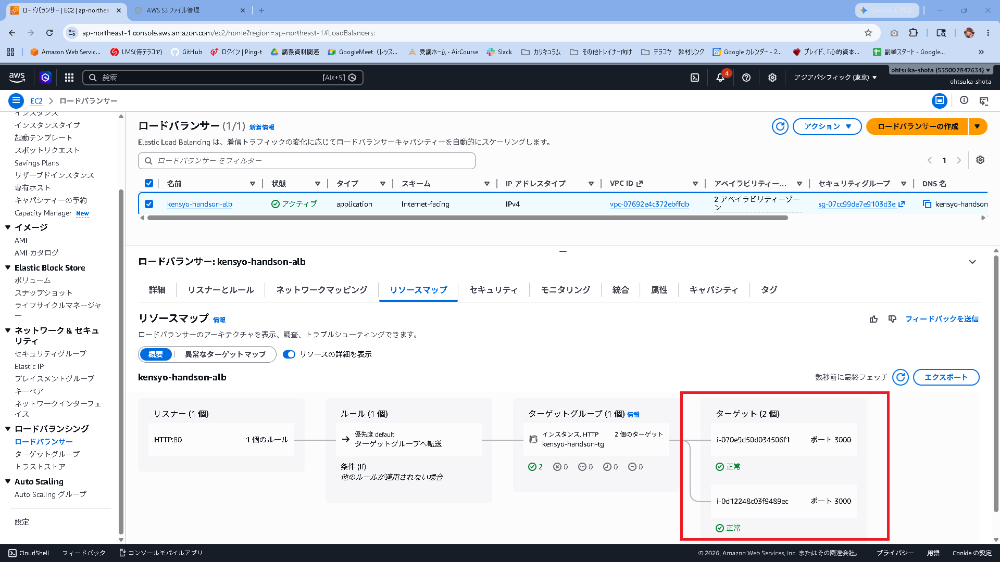

### 8-2. ブラウザでアクセス

```
http://[ALBのDNS名]
```

（ポート番号は不要。ALBがポート80で受け取り3000に転送する）

> **注意：ALB のURLに切り替えたら必ず再ログインすること**
>
> ブラウザはログイン情報（JWTトークン）を「オリジン（URLのホスト名＋ポート）ごと」に保存する。
> EC2のIPで以前ログインしていても、ALBのDNS名は別オリジンとして扱われるため、セッションは引き継がれない。
> ALBのURLで初めてアクセスしたときはログイン済みの状態にならないので、必ずログイン操作を行うこと。
>
> ```
> http://[EC2のIP]:3000 → ここで保存したトークン
> http://[ALBのDNS名]  → 別のオリジン。トークンなし → ログアウト状態
> ```

あるいは異なるWebブラウザかシークレットウィンドウで開いても良い。

### 8-3. ターゲットグループのヘルスチェック確認

1. EC2 コンソール → 「ターゲットグループ」→ `handson-tg` を選択
2. 「ターゲット」タブ → 2台のEC2のステータスが **「healthy」** になっていることを確認

> ヘルスチェックには1〜2分かかる。しばらく待ってから確認する。

### 動作確認チェックリスト

- [ ] `http://[ALBのDNS名]` でアプリのトップページが表示される
- [ ] ログインできる（Cognito認証）
- [ ] レビュー投稿・一覧・AI分析が正常に動作する
- [ ] ターゲットグループの 2 台が「healthy」状態になっている
- [ ] EC2 コンソールで `handson-asg-instance` が2台表示されている

---

## [8-4] 自動復旧テスト（Auto Scaling の動作確認）

EC2 を強制終了しても Auto Scaling が自動で復旧することを体験する。

### Auto Scaling の復旧ルール

Auto Scaling グループは常に「**希望台数（Desired）**」を維持しようとする。

| 操作 | ASG の反応 |
|------|-----------|
| 1台削除 | 1台新規起動（Desired=2 を維持） |
| 2台削除 | 2台新規起動（Desired=2 に戻す） |
| 負荷が下がった | 最小台数（Min=1）まで自動削減 |

> **最小台数（Min=1）の意味:**
> スケールイン（負荷減少時の自動削減）で下がる下限が1台。
> 手動でインスタンスを削除しても、ASGは Desired=2 まで復旧しようとするため、「1台だけ戻る」ということにはならない。

### 「停止」と「終了」の違い

Auto Scaling のテストでは必ず **「インスタンスを終了（Terminate）」** を使うこと。

| 操作 | インスタンスの状態 | ASGの反応 |
|------|-----------------|----------|
| **停止（Stop）** | `stopped` 状態で残る | ASGはまだ「グループ内に存在する」とカウントし続ける。ヘルスチェック失敗後に順番に終了＆置き換えるが時間がかかる |
| **終了（Terminate）** | 即座に消滅 | ASGが即座に検知し、Desired台数に向けて新規起動する |

> 「シャットダウン（OS停止）」や「停止（Stop）」でテストした場合、ASGがすぐに反応しなかったり、1台ずつ順番に置き換えるため「2台消したのに1台しか戻らない」ように見えることがある。
> これはテスト方法の問題であり、ASGの設定が誤っているわけではない。

### テスト手順

**① EC2 を 1 台終了する**

1. EC2 コンソール → 「インスタンス」→ `handson-asg-instance` のどちらか1台を選択
2. 「インスタンスの状態」→ **「インスタンスを終了（Terminate）」** をクリック

> ⚠️ **「停止（Stop）」ではなく「終了（Terminate）」を選ぶこと。**
> 停止だと即時にASGが反応しない。

**② アプリが引き続き動いていることを確認する**
※Webブラウジング時、少しラグがある可能性がある。

```
http://[ALBのDNS名]
```

1台が終了処理に入っても、ALBはもう1台に振り分けを続けるためアプリはダウンしない。

**③ 新しい EC2 が自動起動されることを確認する**

1. EC2 コンソール → 「インスタンス」を確認
2. 数分後（3〜5分）に新しい `handson-asg-instance` が起動してくることを確認

> Auto Scaling がインスタンスの終了を検知し、Desired=2 に戻すため新しいインスタンスを自動起動する。

**④ ターゲットグループが再び 2 台「healthy」になることを確認する**

1. EC2 コンソール → 「ターゲットグループ」→ `handson-tg` を選択
2. 新しいインスタンスが `healthy` になるまで待つ（ヘルスチェックに2〜3分かかる）

修了したAZ側にEC2が自動デプロイされることを確認する。
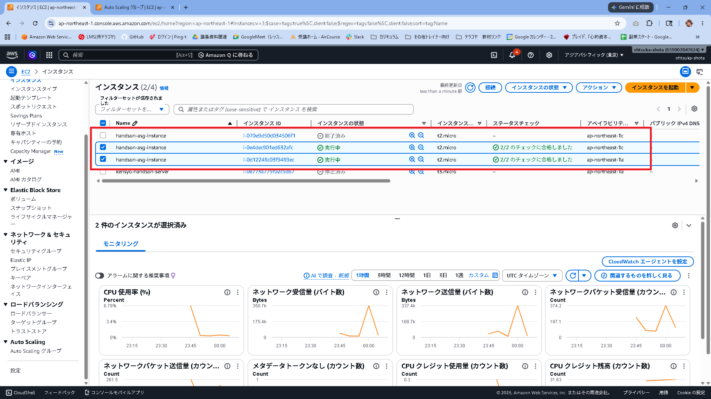

2台終了した時も2台自動で立ち上がってくることが確認できる。
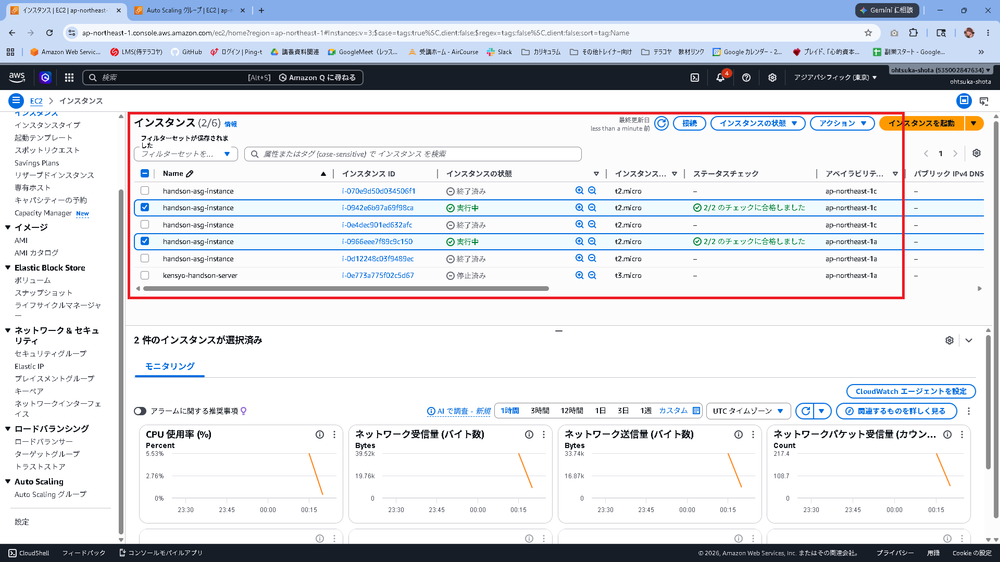

EC2を終了して、AutoScalingで立ち上がっていることはアクティビティからも追跡できる
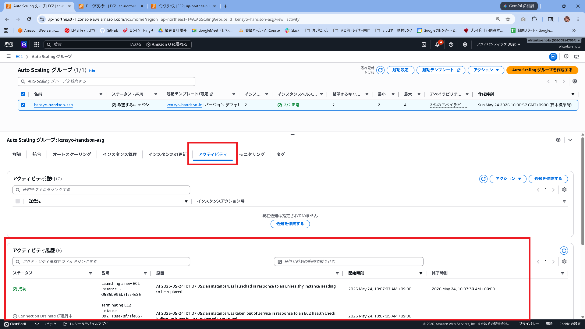


---

## 仕組みの説明（学習者向け）

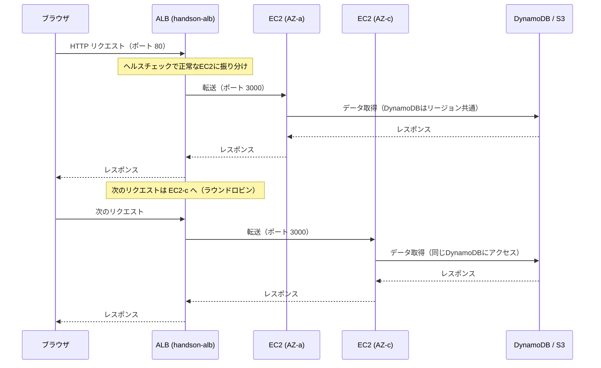

**ポイント:**
- DynamoDB・S3 はリージョンサービスなので、どの EC2 からアクセスしても同じデータが参照される
- JWT 認証はステートレスなため、リクエストがどの EC2 に振られても問題ない
- ALB がヘルスチェックで異常なEC2を検知すると、そのEC2への振り分けを自動的に停止する

---

## トラブルシューティング

### ターゲットが「unhealthy」になる

**確認 1: セキュリティグループの設定**

EC2 の SG インバウンドに「TCP 3000 / ソース: handson-alb-sg」が設定されているか確認する。

**確認 2: PM2 の動作確認**

```bash
# EC2 に SSH して確認
sudo su -
pm2 list
# online になっていない場合
cd ~/samurai-repo/phase05/backend
pm2 start npm --name "handson-app" -- start
pm2 save
```

**確認 3: .env ファイルの確認**

```bash
cat ~/samurai-repo/phase05/backend/.env
```

AMI 作成前に設定した `.env` がそのまま引き継がれているはず。値が空の場合は再設定が必要。

---

### ALB の DNS でアクセスできない（タイムアウト）

- ALB のセキュリティグループで HTTP（ポート80）のインバウンドが `0.0.0.0/0` に開いているか確認
- ALB のネットワークマッピングがパブリックサブネット（インターネットゲートウェイに向いたルートテーブルが関連付けられている）になっているか確認

---

### サブネットが ALB の作成画面に表示されない

- 「ネットワークマッピング」で VPC を選択すると AZ ごとのサブネットが表示される
- `handson-public-subnet-1c` が表示されない場合は、[1-4] のルートテーブル関連付けができているか確認する

---

## [9] ハンズオン終了後のリソース削除（重要）

ALB は**無料枠がなく**、起動中は課金が続く。ハンズオン終了後は必ず削除する。

**削除順序（依存関係があるため順番通りに行う）:**

```
1. Auto Scaling グループを削除
   → EC2側で「インスタンスを終了」も実行する
2. ALB を削除
3. ターゲットグループを削除
4. Launch Template を削除
5. AMI を登録解除
   （EC2コンソール → AMI → 選択 → 「アクション」→「登録解除」）
6. AMI に関連するスナップショットを削除
   （EC2コンソール → スナップショット → 「handson-app-ami」で検索して削除）
7. 元の EC2 インスタンスを停止（または終了）
```

> **スナップショットの削除を忘れずに。**
> AMIを登録解除しても、もとになったスナップショットは残り課金対象になる。

---

## コスト目安

| リソース | 月額目安 | 備考 |
|---------|---------|------|
| ALB | 約 $16〜20 | 固定費。無料枠なし |
| EC2 × 2台（t2.micro） | 無料枠内なら $0 | 枠を超えると約 $17/台 |
| スナップショット（AMI） | 約 $0.05/GB/月 | 削除忘れに注意 |

---

## CloudFormation で環境を自動構築・削除する方法

上記 [1]〜[9] の手順は AWSコンソールで手動操作する方法だが、
`cfn/` フォルダのテンプレートを使えば全リソースをまとめて作成・削除できる。
ハンズオンを複数回に分けて行う場合に便利。

---

### 事前準備：パラメータの確認

デプロイ前に以下の値を手元にメモしておく。

| パラメータ | 確認場所 | 例 |
|-----------|---------|-----|
| **VpcId** | VPCコンソール → VPC → `handson-vpc` の「VPC ID」 | `vpc-0abc1234...` |
| **ExistingSubnet1aId** | VPCコンソール → サブネット → `handson-public-subnet-1a` の「サブネット ID」 | `subnet-0abc1234...` |
| **RouteTableId** | VPCコンソール → ルートテーブル → `handson-public-subnet-1a` に関連付けられている RTB の「ルートテーブル ID」 | `rtb-0abc1234...` |
| **EC2SecurityGroupId** | EC2コンソール → セキュリティグループ → `handson-sg` の「セキュリティグループ ID」 | `sg-0abc1234...` |
| **InstanceProfileName** | 変更していなければ `handson-ec2-role` のまま | `handson-ec2-role` |
| **AmiId** | EC2コンソール → AMI → `handson-app-ami` の「AMI ID」 | `ami-0abc1234...` |
| **KeyPairName** | EC2コンソール → キーペア → 使用しているキーペア名（**`.pem` 拡張子は除く**） | `my-keypair`（`my-keypair.pem` ではない） |

> **AmiId は手順 [3]（AMI作成）の後に確認する。** 作成前にデプロイするとエラーになる。

---

### マネジメントコンソールから操作する場合

マネコンからのデプロイには **`phase6-template-fixed.yaml`**（値ハードコード版）を使う。
このファイルは一度だけ値を書き換えれば、以降はコンソールで何も入力せずデプロイできる。

#### ⚠️ 事前削除が必要なリソース

CFnテンプレートはリソースを新規作成するため、**同名のリソースがすでに存在するとエラーになる。**
ハンズオンを手動で実施済みの場合は、以下を先に削除してからデプロイすること。

| 削除対象 | 名前 | 削除方法 |
|---------|------|---------|
| Auto Scalingグループ | `handson-asg` | EC2コンソール → Auto Scalingグループ → 削除（EC2インスタンスも一緒に削除される） |
| 起動テンプレート | `handson-lt` | EC2コンソール → 起動テンプレート → 削除 |
| ALB | `handson-alb` | EC2コンソール → ロードバランサー → 削除 |
| ターゲットグループ | `handson-tg` | EC2コンソール → ターゲットグループ → 削除 |
| ALB用セキュリティグループ | `handson-alb-sg` | EC2コンソール → セキュリティグループ → 削除 |
| SGのインバウンドルール | `handson-sg` のポート3000ルール | EC2コンソール → セキュリティグループ → `handson-sg` → インバウンドルールを編集 → ポート3000のALBからのルールを削除 |
| サブネット | `handson-public-subnet-1c` | VPCコンソール → サブネット → 削除 |

> **削除しなくてよいもの（テンプレートが参照するだけ）:**
> VPC・サブネット1a・ルートテーブル・EC2用SG（`handson-sg`）・IAMロール・AMI・キーペア

#### 想定する使い方

```
【パターン1】ハンズオン後に再デプロイしたい場合
  手順 [9]（後片付け）で全削除 → CFnで一発再構築

【パターン2】ハンズオンをやり直す場合
  上記リソースを削除 → CFnでデプロイ → 動作確認 → スタック削除 → 繰り返し
```

#### ① YAML ファイルに値を書き込む（初回のみ）

`phase06/cfn/phase6-template-fixed.yaml` をテキストエディタで開き、
ファイル上部の `Mappings` セクションにある `# ← 書き換え` の行を自分の環境の値に書き換える。

```yaml
Mappings:
  Env:
    Config:
      VpcId: vpc-xxxxxxxxxxxxxxxxx        # ← ここを書き換え
      ExistingSubnet1aId: subnet-xxxxxxxxx # ← ここを書き換え
      RouteTableId: rtb-xxxxxxxxxxxxxxxxx  # ← ここを書き換え
      EC2SecurityGroupId: sg-xxxxxxxxxx    # ← ここを書き換え
      InstanceProfileName: handson-ec2-role  # 変更不要
      AmiId: ami-xxxxxxxxxxxxxxxxx         # ← AMI作成後に書き換え
      KeyPairName: your-key-pair-name      # ← ここを書き換え（.pem 拡張子は不要）
```

各値の確認場所は「事前準備」の表を参照。

> **AmiId だけは手順 [3]（AMI作成）の後に書き換える。** 他の値は先に書いておいてよい。

#### ② スタックを作成する

1. AWSマネジメントコンソール → 「CloudFormation」を開く
2. リージョンが **東京（ap-northeast-1）** になっていることを確認
3. 「スタックを作成」→ **「新しいリソースを使用（標準）」** をクリック
4. 「テンプレートソース」→ **「テンプレートファイルのアップロード」** を選択
5. 「ファイルを選択」→ **`phase6-template-fixed.yaml`** をアップロード
6. 「次へ」をクリック
7. スタック名: **`handson-phase6`** と入力 → 「次へ」
8. オプションは変更せず「次へ」→ 確認して **「送信」** をクリック
9. ステータスが **`CREATE_COMPLETE`** になるまで待つ（3〜5分）

#### ③ デプロイ完了後の確認

1. スタックを選択 → **「出力」タブ** を開く
2. `AppUrl` の値をコピーしてブラウザで開く
3. アプリが表示されることを確認してログインする

> **MinSize は `2` に設定済み**のため、デプロイ後にコンソールで変更する必要はない。

#### スタックの削除（ハンズオン終了後）

1. CloudFormationコンソール → 「スタック」一覧
2. `handson-phase6` を選択
3. **「削除」** ボタンをクリック
4. 確認ダイアログで **「削除」** をクリック
5. ステータスが **`DELETE_COMPLETE`** になれば完了（3〜5分）

> **削除されるリソース:** ALB・ターゲットグループ・Auto Scalingグループ・EC2インスタンス・サブネット（handson-public-subnet-1c）
> **削除されないリソース:** VPC・既存サブネット（1a）・セキュリティグループ・AMI・スナップショット
> AMIとスナップショットは手動で削除すること（手順 [9] の 5・6 を参照）。

---

### AWS CLI から操作する場合

**前提:** AWS CLI がインストール済みで `aws configure` の設定が完了していること。

```bash
# インストール確認
aws --version
```

```bash
# cfn/ フォルダに移動
cd /path/to/samurai-repo/phase06/cfn

# スタックを作成
aws cloudformation create-stack \
  --stack-name handson-phase6 \
  --template-body file://phase6-template.yaml \
  --parameters file://phase6-params.json \
  --region ap-northeast-1

# 作成完了を待つ（CREATE_COMPLETE になるまでブロック）
aws cloudformation wait stack-create-complete \
  --stack-name handson-phase6 \
  --region ap-northeast-1

# ALBのURL（AppUrl）を確認
aws cloudformation describe-stacks \
  --stack-name handson-phase6 \
  --region ap-northeast-1 \
  --query "Stacks[0].Outputs"
```

```bash
# スタックを削除
aws cloudformation delete-stack \
  --stack-name handson-phase6 \
  --region ap-northeast-1

# 削除完了を待つ
aws cloudformation wait stack-delete-complete \
  --stack-name handson-phase6 \
  --region ap-northeast-1
```

### 注意点

- `phase6-params.json` の `Comment` フィールドは AWS CLI では無視されるが、JSON として有効なので問題ない
- エラーになった場合は CloudFormationコンソール → スタック → **「イベント」タブ** でエラー内容を確認できる

**ハンズオンで数時間使う程度であれば数十円〜数百円程度。** 必ず終了後に削除すること。
