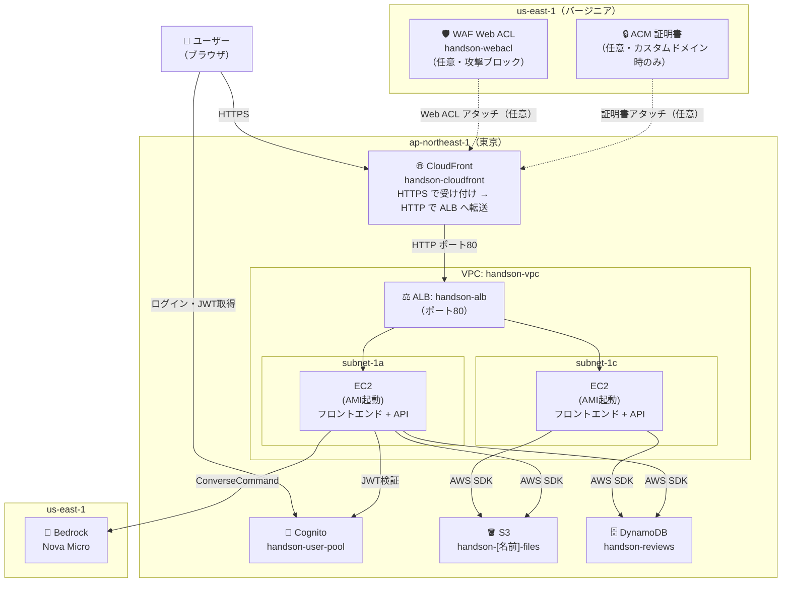
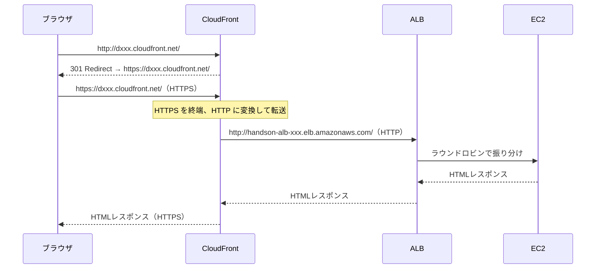

# CloudFront セットアップ手順（Phase 7 ハンズオン）

作成日: 2026-05-23

対象: AWS未経験者向けハンズオン（7回目）

---

## 前提条件

Phase 7 は Phase 6（ALB + Auto Scaling）の環境が動いていることが前提。
以下をすべて満たしてからハンズオンを開始すること。

| 前提条件 | 確認方法 |
|---------|---------|
| Phase 6 の CFn スタック（`handson-phase6`）がデプロイ済み、または手動構築済みであること | CloudFormation コンソール → `handson-phase6` のステータスが `CREATE_COMPLETE` |
| ALB（`handson-alb`）が起動していること | EC2コンソール → ロードバランサー → `handson-alb` の状態が `active` |
| ターゲットグループ（`handson-tg`）の EC2 が 2 台 `healthy` になっていること | EC2コンソール → ターゲットグループ → `handson-tg` → ターゲットタブ |
| `http://[ALBのDNS名]` でアプリにアクセスできること | ブラウザで ALB の DNS 名を開いてログイン確認 |

> **Phase 6 の環境を CFn で素早く再構築する場合:**
> `phase06/cfn/phase6-template-fixed.yaml` の値を書き換えてデプロイすれば 5 分程度で整う。
> 詳細は `docs/06_ALB_AutoScaling_ハンズオン手順.md` の「CloudFormation で環境を自動構築・削除する方法」を参照。

---

## 完成後イメージ

```
[ブラウザ]
    ↓ https://[CloudFrontのドメイン]（または独自ドメイン）
[CloudFront: handson-cloudfront]
    ↓ HTTP → ALB（ポート80）
[ALB: handson-alb]
    ├─→ EC2 (ap-northeast-1a)
    └─→ EC2 (ap-northeast-1c)
           ↓
    [DynamoDB / S3(files) / Cognito / Bedrock]（変更なし）
```

---

## 環境イメージ



---

## ゴール

Phase 6 まで「ALB のドメインに HTTP でアクセス」していたアプリを、
CloudFront を前段に置くことで **HTTPS でアクセスできる** ようにする。
また任意で WAF によるセキュリティ強化・独自ドメインの設定ができる。

アプリのコード・インフラ（ALB・EC2・ASG）への変更は不要。CloudFront を ALB の前に挟むだけ。

---

## 全体の流れ

```
[1] CloudFront ディストリビューションを作成する
    ↓
[2] ブラウザで動作確認
    ↓
[3] （任意）WAF でセキュリティを強化する
    ↓
[4] （任意）カスタムドメインを設定する
    ↓
[5] （後片付け）リソースを削除する
```

---

## AWS 用語集（手順を始める前に読んでおこう）

---

### 今回のテーマ：CloudFront を挟む理由

Phase 6 まではブラウザから ALB に HTTP でアクセスしていた。
HTTP は通信内容が暗号化されていないため、現代のWebでは推奨されない。

```
【Phase 6 まで】
ブラウザ → ALB → EC2
（HTTP、暗号化なし）

【Phase 7 以降】
ブラウザ → CloudFront（HTTPS）→ ALB → EC2
（HTTPS で暗号化、独自ドメイン対応）
```

CloudFront がブラウザとの通信を HTTPS で受け取り、ALB への転送は内部ネットワークの HTTP で行う。

---

### CloudFront（クラウドフロント）

世界中に配置されたサーバー（エッジロケーション）を使ってコンテンツを高速・安全に配信するサービス（CDN）。

今回使う主な機能:

| 機能 | 内容 |
|------|------|
| **HTTPS 対応** | ブラウザとの通信を暗号化する。証明書は CloudFront が管理 |
| **独自ドメイン対応** | `xxx.cloudfront.net` の代わりに自分のドメインを使える |
| **DDoS 保護** | AWS Shield Standard が自動で有効になる |

---

### ディストリビューション

CloudFront の設定一式のこと。「どこから受け取り、どこへ転送するか」をまとめたもの。
1つのディストリビューションに複数のオリジン（転送先）やルールを設定できる。

---

### オリジン（Origin）

CloudFront がリクエストを転送する先のこと。今回は ALB がオリジンになる。

```
ブラウザ → CloudFront（フロント） → ALB（オリジン）→ EC2
```

---

### ビューワープロトコルポリシー

ブラウザ（ビューワー）と CloudFront の間の通信方式を決める設定。

| 設定値 | 意味 |
|-------|------|
| HTTP と HTTPS を許可 | どちらでもアクセスできる |
| **Redirect HTTP to HTTPS** | HTTP でアクセスされたら HTTPS に転送（今回はこれ） |
| HTTPS のみ | HTTP を拒否する |

---

### SSL/TLS 証明書

HTTPS 通信を可能にするための「身分証明書」のようなもの。
CloudFront 専用のデフォルト証明書（`*.cloudfront.net`）が無料で使える。
独自ドメインを使う場合は ACM（Certificate Manager）で証明書を発行する必要がある。

---

### ACM（AWS Certificate Manager）

AWS が提供する SSL/TLS 証明書の発行・管理サービス。
CloudFront に使う証明書は **必ず us-east-1（バージニア北部）で発行する必要がある**。

> 料金: パブリック証明書の発行・維持は**無料**

---

### WAF（Web Application Firewall）

Web アプリケーションを悪意のある攻撃から守るファイアウォール。
SQL インジェクション（データベースを不正操作する攻撃）や XSS（クロスサイトスクリプティング）などの
よく知られた攻撃パターンを検出し、自動的にブロックする。

CloudFront の前段に設置することで、EC2 や ALB に届く前に悪意のあるリクエストを弾ける。

> **CloudFront 用 WAF は必ず us-east-1（バージニア北部）で作成する。**

---

### Web ACL（ウェブアクセスコントロールリスト）

WAF の「ルールブック」のこと。
「このパターンのリクエストはブロックする / 許可する」という判断基準をまとめたもの。
1 つの Web ACL に複数のルールグループを追加できる。

---

### マネージドルール / AWSManagedRulesCommonRuleSet

AWS があらかじめ用意している攻撃パターンのルールセット。
自分でルールを書かなくても、一般的な Web 攻撃（SQL インジェクション・XSS・悪意のあるスキャンなど）を
自動でブロックできる。今回はこのルールセットを 1 つ追加する。

---

## [1] CloudFront ディストリビューションを作成する

### 1-1. CloudFront コンソールを開く

1. AWSマネジメントコンソール → 「CloudFront」を開く
2. リージョンの表示は気にしなくてよい（CloudFront はグローバルサービス）

### 1-2. ディストリビューションを作成する

「ディストリビューションを作成」をクリックし、以下を設定する。

**オリジンの設定（転送先 = ALB）**

| 項目 | 値 |
|------|-----|
| オリジンドメイン | Phase 6 で作成した ALB の DNS 名（ドロップダウンから `handson-alb-xxx.ap-northeast-1.elb.amazonaws.com` を選択） |
| プロトコル | HTTP のみ |
| HTTP ポート | 80 |
| 名前 | `AlbOrigin`（自動入力されるが分かりやすい名前に変更してOK） |

> **「HTTPS プロトコルを使用することを推奨します」という警告が出る場合:**
> ALB は HTTP のみ設定しているため HTTP を選択する。ブラウザとの通信は CloudFront が HTTPS で担当するので問題ない。

**デフォルトキャッシュビヘイビアの設定**

| 項目 | 値 |
|------|-----|
| ビューワープロトコルポリシー | Redirect HTTP to HTTPS |
| 許可された HTTP メソッド | GET, HEAD, OPTIONS, PUT, POST, PATCH, DELETE |
| キャッシュポリシー | CachingDisabled（AWS管理ポリシー） |
| オリジンリクエストポリシー | AllViewer（すべてのヘッダー・Cookie を ALB に転送） |

> **キャッシュを無効にする理由:**
> API レスポンスとログイン状態（Cookie・JWT）を正しく ALB まで届けるため。

**WAF 設定**

| 項目 | 値 |
|------|-----|
| セキュリティ保護を有効 | 「セキュリティ保護を有効にしない」を選択 |

> ここでは無効にする。WAF を設定したい場合はディストリビューション作成後に [3] で別途設定する。

**設定（全般）**

| 項目 | 値 |
|------|-----|
| 説明（任意） | `handson-cloudfront` |

### 1-3. 作成を完了する

「ディストリビューションを作成」をクリック。

> **デプロイには 3〜5 分かかる。** ステータスが「有効」になるまで待つ。

---

## [2] ブラウザで動作確認

### 2-1. CloudFront の URL を確認する

1. CloudFront コンソール → ディストリビューションを選択
2. 「ディストリビューションドメイン名」をコピー（例: `dxxxxxxxxxxxxxxx.cloudfront.net`）

### 2-2. ブラウザでアクセスする

```
https://dxxxxxxxxxxxxxxx.cloudfront.net
```

HTTP でアクセスしても自動で HTTPS にリダイレクトされることを確認する:
```
http://dxxxxxxxxxxxxxxx.cloudfront.net
↓ 自動リダイレクト
https://dxxxxxxxxxxxxxxx.cloudfront.net
```

### 動作確認チェックリスト

- [ ] `https://[CloudFrontドメイン]` でアプリのトップページが表示される
- [ ] ブラウザのアドレスバーに鍵マーク（🔒）が表示されている
- [ ] `http://` でアクセスすると `https://` に自動リダイレクトされる
- [ ] ログインできる（Cognito 認証）
- [ ] レビュー投稿・一覧・AI 分析が正常に動作する
- [ ] S3 ファイル管理が正常に動作する

---

## 仕組みの説明（学習者向け）



**ポイント:**
- ブラウザと CloudFront の間: **HTTPS**（暗号化あり）
- CloudFront と ALB の間: **HTTP**（内部ネットワーク、暗号化なし）
- この構成を「SSL ターミネーション」と呼ぶ。CloudFront が証明書を管理するため EC2 に証明書を設定する必要がない

---

## [3] （任意）WAF でセキュリティを強化する

CloudFront に WAF（Web Application Firewall）を設定し、一般的な攻撃パターンをブロックする。
**Route 53 やカスタムドメインがなくても設定できる。** 興味があれば試してみよう。

> **費用目安:** Web ACL $5/月 + AWSManagedRulesCommonRuleSet $1/月 = **約 $6/月**
> ハンズオン終了後は必ず削除すること。

---

### 3-1. リージョンを us-east-1（バージニア北部）に切り替える

> CloudFront 用 WAF は必ず **us-east-1** で作成する必要がある。

1. コンソール右上のリージョンを **「米国東部（バージニア北部）us-east-1」** に切り替える

---

### 3-2. WAF & Shield コンソールを開く

1. 「WAF & Shield」を検索して開く
2. 左メニューから「Web ACLs」を選択

---

### 3-3. Web ACL を作成する

「Web ACL を作成」をクリックし、以下を設定する。

**ステップ 1: 説明と関連付け**

| 項目 | 値 |
|------|-----|
| リソースタイプ | CloudFront ディストリビューション |
| 名前 | `handson-webacl` |
| 説明（任意） | `handson Phase 7 WAF` |

「関連付けられた AWS リソース」の「AWS リソースを追加」をクリック:

| 項目 | 値 |
|------|-----|
| リソースタイプ | CloudFront ディストリビューション |
| リソース | `handson-cloudfront`（[1] で作成したディストリビューション） |

「追加」→「次へ」をクリック。

---

**ステップ 2: ルールを追加する**

「マネージドルールグループを追加する」をクリックし、以下を追加する。

| 項目 | 値 |
|------|-----|
| AWS マネージドルールグループ | **AWSManagedRulesCommonRuleSet** |

「ルールグループをルールに追加」をクリック → リスト に追加されたことを確認 → 「次へ」。

> **AWSManagedRulesCommonRuleSet とは:**
> SQL インジェクション・XSS・悪意のあるスキャンなど、Web アプリの典型的な攻撃 をブロックするルールセット。
> AWS が内容を管理するため、自分でルールを書く必要がない。

---

**ステップ 3〜5: デフォルトのまま進む**

- ステップ 3（ルールの優先度）: そのまま「次へ」
- ステップ 4（CloudWatch メトリクス）: そのまま「次へ」
- ステップ 5（確認）: 内容を確認して「Web ACL を作成」をクリック

---

### 3-4. 動作確認

Web ACL の作成後、CloudFront ディストリビューションに関連付けが完了するまで数分かかる。

**確認:**
- WAF コンソール → 「Web ACLs」→ `handson-webacl` を選択
- 「関連付けられた AWS リソース」タブ → `handson-cloudfront` が表示されていれば OK

**ブラウザでの動作確認:**
- `https://[CloudFrontドメイン]` で引き続きアプリが正常に動作することを確認する
- 通常のアクセスはブロックされない

---

### [3] WAF の削除手順

WAF を削除する場合は **CloudFront ディストリビューションとの関連付けを先に解除** する必要がある。

```
1. WAF コンソール（us-east-1）→「Web ACLs」→「handson-webacl」を選択
2. 「関連付けられた AWS リソース」タブ → handson-cloudfront を選択 →「関連付けの解除」
3. 「handson-webacl」を選択 →「削除」
```

---

## [4] （任意）カスタムドメインを設定する

独自ドメイン（例: `handson.example.com`）でアクセスできるようにする。
**Route 53 でドメインを管理していることが前提。**

### 4-1. ACM で SSL 証明書を発行する

> **必ず `us-east-1`（バージニア北部）で作業すること。**
> CloudFront に使う証明書は us-east-1 でしか利用できない。

1. コンソール右上のリージョンを **「米国東部（バージニア北部）us-east-1」** に切り替える
2. 「Certificate Manager（ACM）」を開く
3. 「証明書をリクエスト」→「パブリック証明書」→「次へ」
4. 以下を設定:

| 項目 | 値 |
|------|-----|
| ドメイン名 | 自分のドメイン（例: `handson.example.com`） |
| 検証方法 | DNS 検証 |

5. 「リクエスト」をクリック
6. 証明書一覧から作成した証明書を選択 → 「Route 53 でレコードを作成」→「レコードを作成」

> Route 53 に確認用の CNAME レコードが自動で追加される。
> 数分〜数十分後に証明書のステータスが「**発行済み**」になる。

### 4-2. CloudFront にカスタムドメインを設定する

リージョンを**東京（ap-northeast-1）**に戻す。

1. CloudFront コンソール → ディストリビューションを選択 → 「全般」タブ → 「編集」
2. 以下を設定:

| 項目 | 値 |
|------|-----|
| 代替ドメイン名（CNAME） | `handson.example.com` |
| カスタム SSL 証明書 | [3-1] で発行した証明書を選択 |

3. 「変更を保存」をクリック（デプロイに数分かかる）

### 4-3. Route 53 に DNS レコードを追加する

1. Route 53 コンソール → 「ホストゾーン」→ 自分のドメインを選択
2. 「レコードを作成」
3. 以下を設定:

| 項目 | 値 |
|------|-----|
| レコード名 | `handson`（`handson.example.com` の場合） |
| レコードタイプ | A |
| エイリアス | オン |
| トラフィックのルーティング先 | 「CloudFront ディストリビューションへのエイリアス」→ ディストリビューションを選択 |

4. 「レコードを作成」をクリック
5. 数分後に `https://handson.example.com` でアクセスできるようになる

---

## トラブルシューティング

### ログインできない・認証エラーが出る

JWT の検証が Cognito に対して行われるが、Cognito が別ドメインからのアクセスを想定していない場合がある。

**確認:** Cognito コンソール → ユーザープール → アプリクライアント → コールバック URL に CloudFront のドメインが含まれているか確認する。

含まれていない場合:
- Cognito → アプリクライアントの設定 → コールバック URL に `https://[CloudFrontドメイン]/` を追加する

### ページが表示されない（504 エラー・タイムアウト）

CloudFront から ALB への接続がタイムアウトしている可能性がある。

**確認 1:** ALB が正常に動作しているか
- Phase 6 の手順書を参照し、ターゲットグループのヘルスチェックが `healthy` か確認

**確認 2:** CloudFront のオリジン設定
- CloudFront → ディストリビューション → オリジン → ALB のドメイン名・ポート（80）が正しいか確認

### HTTP から HTTPS にリダイレクトされない

ビヘイビアの「ビューワープロトコルポリシー」が「Redirect HTTP to HTTPS」になっているか確認する。
- CloudFront → ディストリビューション → ビヘイビア → デフォルト（`*`）を編集

---

## [5] ハンズオン終了後のリソース削除

CloudFront は**リクエスト課金**のためほとんど費用はかからないが、
WAF は月額固定費用がかかるため、ハンズオン終了後は必ず削除すること。
以下の順番で削除する。

**削除順序:**

```
1. WAF の関連付けを解除（WAF を設定した場合）
   → WAF コンソール（us-east-1）→「Web ACLs」→「handson-webacl」
   →「関連付けられた AWS リソース」タブ → handson-cloudfront を選択 →「関連付けの解除」

2. WAF Web ACL を削除（WAF を設定した場合）
   → 「handson-webacl」を選択 →「削除」
   ※ 先に関連付けを解除しないと削除できない

3. CloudFront ディストリビューションを無効化
   → ディストリビューション選択 →「無効にする」→「変更を保存」
   ※ 無効化には数分かかる

4. ディストリビューションを削除
   → ステータスが「無効」になってから「削除」をクリック

5. Route 53 レコードを削除（カスタムドメインを設定した場合）

6. ACM 証明書を削除（カスタムドメインを設定した場合）
   → us-east-1 の ACM コンソールで削除

7. Phase 6 のリソース（ALB・ASG など）を削除
   → 06_ALB_AutoScaling_ハンズオン手順.md の [9] を参照
```

---

## コスト目安

| リソース | 費用 | 備考 |
|---------|------|------|
| CloudFront | 無料枠：1TB/月のデータ転送・1,000万リクエスト/月 | ハンズオン程度なら $0 |
| ACM 証明書 | **無料** | パブリック証明書の発行・維持費用なし |
| Route 53 レコード | $0.50/月（ホストゾーン） + クエリ費用 | ドメインを Route 53 で管理している場合のみ |
| WAF Web ACL | **$5/月** | Web ACL 1 つにつき固定 |
| WAF ルールグループ | **$1/月**（AWSManagedRulesCommonRuleSet） | ルールグループ 1 つにつき固定。**ハンズオン後は削除すること** |
