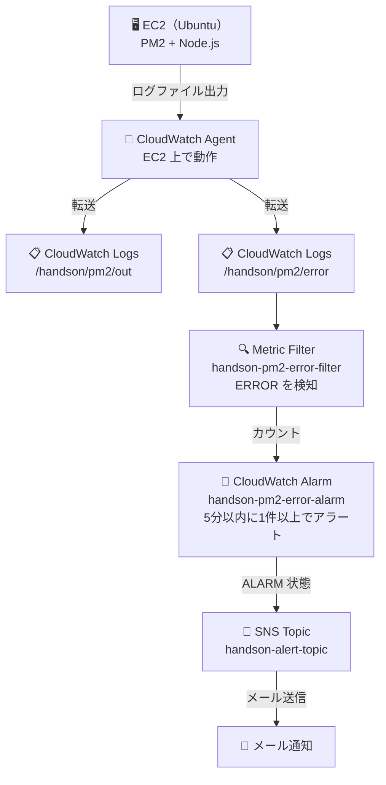

# Phase 08: CloudWatch Logs + SNS アラート ハンズオン手順

## 完成後イメージ

EC2 上で PM2 が管理する Node.js アプリのログを CloudWatch Logs に集約し、  
エラーを検知したら SNS 経由でメール通知が届く監視環境を構築する。

```
EC2（PM2 + Node.js）
  ↓ ログファイル出力
CloudWatch Agent
  ↓
CloudWatch Logs（ロググループ: /handson/pm2/error）
  ↓ Metric Filter（ERROR を検知）
CloudWatch Alarm（5分以内に1件以上でアラート）
  ↓
SNS Topic（handson-alert-topic）
  ↓
メール通知（登録アドレスに届く）
```

---

## 環境イメージ



---

## 前提条件

| 項目 | 確認内容 |
|------|---------|
| EC2 が起動していること | EC2 コンソールで `running` を確認（Phase 06 または 07 で作成した EC2） |
| PM2 でアプリが動いていること | EC2 に SSH して `pm2 list` で `online` を確認 |
| handson-ec2-role が EC2 にアタッチされていること | EC2 詳細 → IAM ロール欄を確認 |

> ✅ **ALB・CloudFront は起動していなくて構わない。**  
> 本手順は EC2 上の PM2 プロセスを監視するものであり、ALB・CloudFront は不要。  
> 費用削減のため、使用しない場合は停止・削除したままで問題ない。

---

## 手順

### 1. IAM ロールに CloudWatch 権限を追加

CloudWatch Agent が EC2 からログを送信するために、  
`handson-ec2-role` に AWS 管理ポリシーを追加する。

1. IAM コンソール → **ロール** → `handson-ec2-role` を開く
2. **許可を追加** → **ポリシーをアタッチ** をクリック
3. 検索欄に `CloudWatchAgentServerPolicy` と入力
4. `CloudWatchAgentServerPolicy` にチェック → **許可を追加** をクリック

---

### 2. EC2 に SSH 接続

```bash
ssh -i ~/.ssh/[キーペア名].pem ubuntu@<EC2のパブリックIP>
```

---

### 3. CloudWatch Agent をインストール

```bash
wget https://amazoncloudwatch-agent.s3.amazonaws.com/ubuntu/amd64/latest/amazon-cloudwatch-agent.deb
sudo dpkg -i ./amazon-cloudwatch-agent.deb
```

インストール確認：

```bash
/opt/aws/amazon-cloudwatch-agent/bin/amazon-cloudwatch-agent-ctl --version
```

---

### 4. PM2 のログパスを確認

設定ファイルに記載するため、PM2 のログ保存先を確認する。

```bash
pm2 info handson-app
```

> `Log file` の欄に表示されるパスを控える。  
> 例: `/root/.pm2/logs/handson-app-out.log` / `/root/.pm2/logs/handson-app-error.log`

---

### 5. CloudWatch Agent の設定ファイルを作成

```bash
sudo nano /opt/aws/amazon-cloudwatch-agent/etc/amazon-cloudwatch-agent.json
```

以下を貼り付ける（ログパスは手順 4 で確認した値に合わせて修正）：

```json
{
  "logs": {
    "logs_collected": {
      "files": {
        "collect_list": [
          {
            "file_path": "/root/.pm2/logs/*-out.log",
            "log_group_name": "/handson/pm2/out",
            "log_stream_name": "{instance_id}",
            "timestamp_format": "%Y-%m-%dT%H:%M:%S"
          },
          {
            "file_path": "/root/.pm2/logs/*-error.log",
            "log_group_name": "/handson/pm2/error",
            "log_stream_name": "{instance_id}",
            "timestamp_format": "%Y-%m-%dT%H:%M:%S"
          }
        ]
      }
    }
  }
}
```

> ⚠️ `file_path` は手順 4 で確認した実際のパスに合わせること。  
> ワイルドカード `*` を使うと複数ファイルをまとめて収集できる。

保存: `Ctrl+X` → `Y` → `Enter`

---

### 6. CloudWatch Agent を起動

```bash
sudo /opt/aws/amazon-cloudwatch-agent/bin/amazon-cloudwatch-agent-ctl \
  -a fetch-config \
  -m ec2 \
  -c file:/opt/aws/amazon-cloudwatch-agent/etc/amazon-cloudwatch-agent.json \
  -s
```

状態確認：

```bash
sudo /opt/aws/amazon-cloudwatch-agent/bin/amazon-cloudwatch-agent-ctl \
  -a status
```

`"status": "running"` が表示されれば OK。

自動起動の設定：

```bash
sudo systemctl enable amazon-cloudwatch-agent
```

---

### 7. CloudWatch Logs でログが届いているか確認

1. CloudWatch コンソール → **ロググループ** を開く
2. `/handson/pm2/out` と `/handson/pm2/error` が作成されていることを確認
3. ロググループ → ログストリームをクリックしてログが表示されることを確認

> ⏱️ Agent 起動後、最初のログが届くまで 1〜2 分かかる場合がある。

> **`/handson/pm2/error` が表示されない場合:**
> エラーログファイルに一度も書き込みがないとロググループが作成されない。
> EC2 に SSH して以下を実行し、テスト用のエラーログを書き込む。
>
> ```bash
> echo "$(date -Iseconds) ERROR: テスト用エラーログ" >> /root/.pm2/logs/handson-app-error.log
> ```
>
> 1〜2 分後に CloudWatch コンソールを更新すると `/handson/pm2/error` が表示される。

---

### 8. SNS トピックの作成・メール購読登録

#### 8-1. SNS トピックを作成

1. SNS コンソール → **トピック** → **トピックの作成** をクリック
2. 以下を入力：

| 項目 | 値 |
|------|---|
| タイプ | スタンダード |
| 名前 | `handson-alert-topic` |

3. **トピックの作成** をクリック
4. 表示された **ARN** を控えておく（後の手順で使用）

#### 8-2. メールアドレスにサブスクリプションを作成

1. 作成したトピック → **サブスクリプションの作成** をクリック
2. 以下を入力：

| 項目 | 値 |
|------|---|
| プロトコル | Eメール |
| エンドポイント | 通知を受け取るメールアドレス |

3. **サブスクリプションの作成** をクリック
4. 登録メールアドレスに確認メールが届くので **Confirm subscription** リンクをクリック

> ⚠️ 確認リンクをクリックしないと通知が届かない。

---

### 9. Metric Filter を作成

エラーログから `ERROR` を含む行を検知するフィルターを作成する。

1. CloudWatch コンソール → **ロググループ** → `/handson/pm2/error` を開く
2. **メトリクスフィルター** タブ → **メトリクスフィルターの作成** をクリック
3. 以下を入力：

| 項目 | 値 |
|------|---|
| フィルターパターン | `ERROR` |

4. **次へ** をクリック
5. メトリクスの詳細を入力：

| 項目 | 値 |
|------|---|
| フィルター名 | `handson-pm2-error-filter` |
| メトリクス名前空間 | `HandsonApp` |
| メトリクス名 | `PM2ErrorCount` |
| メトリクス値 | `1` |
| デフォルト値 | `0` |

6. **次へ** → **メトリクスフィルターの作成** をクリック

---

### 10. CloudWatch Alarm を作成

Metric Filter から直接アラームを作成する。この方法ならメトリクスにデータが届いていない状態でも設定できる。

1. CloudWatch コンソール → **ロググループ** → `/handson/pm2/error` を開く
2. **「メトリクスフィルター」** タブをクリック
3. `handson-pm2-error-filter` の左側の **チェックボックスにチェック** を入れる
4. 右上に表示される **「アラームを作成」** をクリック
5. 条件を設定：

| 項目 | 値 |
|------|---|
| 統計 | 合計（Sum） |
| 期間 | 5分 |
| 条件 | 以上（>=） |
| 閾値 | `1` |

6. **次へ** をクリック
7. 通知の設定：

| 項目 | 値 |
|------|---|
| アラーム状態トリガー | アラーム状態（ALARM） |
| SNS トピック | `handson-alert-topic`（既存のトピックを選択） |

8. **次へ** → アラーム名に `handson-pm2-error-alarm` を入力
9. **アラームの作成** をクリック

---

### 11. 動作確認（テスト）

#### 11-1. テストログを手動で出力する

EC2 に SSH 接続して、エラーログに `ERROR` を含む行を書き込む。

```bash
echo "$(date -Iseconds) ERROR: テスト用エラーログ" >> /root/.pm2/logs/handson-app-error.log
```

#### 11-2. CloudWatch Logs で確認

1. CloudWatch コンソール → `/handson/pm2/error` → ログストリームを開く
2. 書き込んだ `ERROR` ログが表示されることを確認

#### 11-3. メトリクスを確認

1. CloudWatch コンソール → **メトリクス** → **すべてのメトリクス** → `HandsonApp` → `PM2ErrorCount`
2. グラフに値が上がっていることを確認

#### 11-4. メール通知を確認

1. CloudWatch コンソール → **アラーム** → `handson-pm2-error-alarm` の状態を確認
2. 5分以内に **ALARM** 状態に変わる
3. 登録メールアドレスにアラート通知が届く

> ⏱️ アラームが ALARM 状態になるまで最大 5 分かかる。

届くメールの内容は以下のような形式になる。各項目の見方を確認しておこう。

```
件名: ALARM: "handson-pm2-error-alarm" in Asia Pacific (Tokyo)

You are receiving this email because your Amazon CloudWatch Alarm
"handson-pm2-error-alarm" in the Asia Pacific (Tokyo) region has
entered the ALARM state, because "Threshold Crossed: 1 out of the
last 1 datapoints [4.0 (30/05/26 14:20:00)] was greater than or
equal to the threshold (1.0)."

Alarm Details:
- Name:                 handson-pm2-error-alarm
- State Change:         INSUFFICIENT_DATA -> ALARM        ← 状態の遷移
- Reason for State Change:
    Threshold Crossed: 1 out of the last 1 datapoints
    [4.0] was greater than or equal to the threshold (1.0).
- Timestamp:            Saturday 30 May, 2026 14:30:59 UTC
- AWS Account:          xxxxxxxxxxxx                      ← アカウントID（各自異なる）
- Alarm Arn:            arn:aws:cloudwatch:ap-northeast-1:xxxxxxxxxxxx:alarm:handson-pm2-error-alarm

Threshold:
- The alarm is in the ALARM state when the metric is
  GreaterThanOrEqualToThreshold 1.0 for at least 1 of the
  last 1 period(s) of 300 seconds.                        ← 5分間で1件以上

Monitored Metric:
- MetricNamespace:      HandsonApp
- MetricName:           PM2ErrorCount
- Period:               300 seconds                       ← 監視間隔（5分）
- Statistic:            Sum                               ← 集計方法（合計）
- TreatMissingData:     missing                           ← データ欠損時の扱い

State Change Actions:
- ALARM: [arn:aws:sns:ap-northeast-1:xxxxxxxxxxxx:handson-alert-topic]
```

**メールの主な見どころ:**

| 項目 | 意味 |
|------|------|
| `State Change` | アラームの状態変化。`INSUFFICIENT_DATA → ALARM` はデータ取得後初めて閾値を超えたことを示す |
| `Reason for State Change` | 何件のデータが閾値を超えたかの詳細 |
| `Period: 300 seconds` | 5分ごとにメトリクスを評価していることを示す |
| `TreatMissingData: missing` | データがない期間はアラーム評価をスキップする設定 |

---

### 12. 後片付け（学習終了後）

学習終了後にリソースを削除してコストを抑える。

| リソース | 削除場所 |
|---------|---------|
| CloudWatch Alarm | CloudWatch → アラーム → `handson-pm2-error-alarm` を削除 |
| Metric Filter | CloudWatch → ロググループ → `/handson/pm2/error` → メトリクスフィルタータブ → 削除 |
| ロググループ | CloudWatch → ロググループ → `/handson/pm2/out` `/handson/pm2/error` を削除 |
| SNS トピック | SNS → トピック → `handson-alert-topic` を削除 |
| SNS サブスクリプション | SNS → サブスクリプション → 削除（トピック削除時に自動削除される） |
| CloudWatch Agent | EC2 上で停止（EC2 自体を停止するなら不要） |

---

## トラブルシューティング

### `/handson/pm2/error` がいつまでも表示されない

#### 原因1: エラーログファイルに書き込みがない

ロググループはログファイルに書き込みが発生して初めて作成される。
以下でテスト用のエラーログを書き込む。

```bash
echo "$(date -Iseconds) ERROR: テスト用エラーログ" >> /root/.pm2/logs/handson-app-error.log
```

1〜2 分後に CloudWatch コンソールを更新して確認する。

---

#### 原因2: 設定ファイルのパスにスペースや誤りがある

Agent が実際に監視しているファイルは `state/` フォルダで確認できる。

```bash
ls /opt/aws/amazon-cloudwatch-agent/logs/state/
```

`_root_.pm2_logs_handson-app-out.log` はあるが `_root_.pm2_logs_handson-app-error.log` がない場合、
`error.log` が監視対象になっていない。

設定ファイルの中身を確認する：

```bash
sudo cat /opt/aws/amazon-cloudwatch-agent/etc/amazon-cloudwatch-agent.d/file_amazon-cloudwatch-agent.json
```

`file_path` の値に **先頭スペース** などが入っていないか確認する。

```json
"file_path": " /root/.pm2/logs/handson-app-error.log"
              ↑ このようなスペースがあると監視されない
```

**修正手順:**

```bash
sudo nano /opt/aws/amazon-cloudwatch-agent/etc/amazon-cloudwatch-agent.d/file_amazon-cloudwatch-agent.json
```

スペースを削除して保存したあと、設定を再読み込みする：

```bash
sudo /opt/aws/amazon-cloudwatch-agent/bin/amazon-cloudwatch-agent-ctl \
  -a fetch-config \
  -m ec2 \
  -c file:/opt/aws/amazon-cloudwatch-agent/etc/amazon-cloudwatch-agent.d/file_amazon-cloudwatch-agent.json \
  -s
```

再度 `state/` を確認し、`error` のファイルが追加されていれば監視開始されている。

---

### Agent が起動しない・停止している

```bash
sudo systemctl restart amazon-cloudwatch-agent
sudo /opt/aws/amazon-cloudwatch-agent/bin/amazon-cloudwatch-agent-ctl -a status
```

`"status": "running"` になれば OK。

Agent 自身のログでエラー内容を確認することもできる：

```bash
sudo tail -50 /opt/aws/amazon-cloudwatch-agent/logs/amazon-cloudwatch-agent.log
```

---

## 本手順で学べること

| 項目 | 内容 |
|------|------|
| CloudWatch Agent | EC2 にインストールしてログを CloudWatch に転送する仕組み |
| CloudWatch Logs | ロググループ・ログストリームの構造とログ収集 |
| Metric Filter | ログのテキストパターンからメトリクスを生成する方法 |
| CloudWatch Alarm | メトリクス閾値監視とアラーム状態の仕組み |
| SNS | トピック・サブスクリプションによるメール通知の仕組み |
