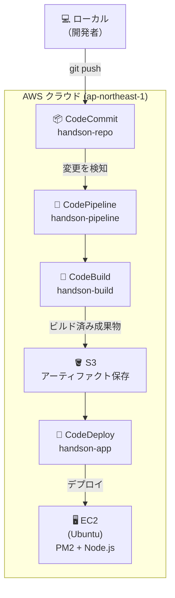

# Phase 09: CodeCommit + CodePipeline + CodeBuild + CodeDeploy ハンズオン手順

作成日: 2026-05-30

対象: AWS未経験者向けハンズオン（9回目）

---

## 前提条件

| 前提条件 | 確認方法 |
|---------|---------|
| EC2 が起動していること | EC2 コンソールで `running` を確認 |
| PM2 でアプリが動いていること | EC2 に SSH して `pm2 list` で `online` を確認 |
| `handson-ec2-role` が EC2 にアタッチされていること | EC2 詳細 → IAM ロール欄を確認 |
| IAM ユーザーが作成済みであること | IAM コンソールでユーザーを確認 |

---

## 完成後イメージ

```
ローカルで git push
    ↓
CodeCommit（ソースリポジトリ）
    ↓
CodePipeline（push を自動検知してパイプラインを起動）
    ↓
CodeBuild（npm install + TypeScript ビルド + Vite ビルド → S3 に保存）
    ↓
CodeDeploy（S3 からアーティファクトを取得 → EC2 に展開 → PM2 再起動）
    ↓
アプリに変更が反映される
```

---

## 環境イメージ



---

## 全体の流れ

```
[1] IAM の準備
    ↓
[2] CodeCommit リポジトリを作成する
    ↓
[3] EC2 に CodeDeploy エージェントを導入する
    ↓
[4] appspec.yml とデプロイスクリプトを作成する
    ↓
[5] buildspec.yml を作成する
    ↓
[6] CodeDeploy を設定する
    ↓
[7] CodeBuild プロジェクトを作成する
    ↓
[8] CodePipeline でパイプラインを作成する
    ↓
[9] 動作確認
    ↓
[10] ハンズオン終了後のリソース削除
```

---

## AWS 用語集

### CodeCommit

AWS が提供する Git リポジトリサービス。GitHub の AWS 版のようなもの。
コードを AWS 上で管理できる。

### CodeDeploy

EC2 などへのデプロイを自動化するサービス。
`appspec.yml` というファイルで「どのファイルをどこに置き、何を実行するか」を定義する。

### CodeBuild

ソースコードのビルドを自動化するサービス。
`buildspec.yml` で「何をインストールして、何をビルドするか」を定義する。

### CodePipeline

ソース取得 → ビルド → デプロイの一連の流れを自動化するサービス。
CodeCommit・CodeBuild・CodeDeploy をつなぎ合わせる役割を担う。

### appspec.yml

CodeDeploy の設定ファイル。リポジトリのルートに置く。
「どのファイルをどこにコピーするか」と「デプロイの各段階でどのスクリプトを実行するか」を定義する。

### buildspec.yml

CodeBuild の設定ファイル。リポジトリのルートに置く。
「何をインストールして、何をビルドして、何を成果物として保存するか」を定義する。

### アーティファクト

ビルドの成果物のこと。
CodeBuild がビルドした結果を S3 に保存し、CodeDeploy がそれを取得して EC2 にコピーする。

### デプロイグループ

CodeDeploy でデプロイ対象の EC2 を指定する設定。
EC2 の Name タグを使って対象インスタンスを絞り込む。

---

## [1] IAM の準備

### 1-1. CodeCommit 接続用の IAM 認証情報を発行する

CodeCommit に HTTPS で push するための認証情報を発行する。

1. IAM コンソール → **ユーザー** → 自分の IAM ユーザーを選択
2. **セキュリティ認証情報** タブ → 下にスクロール
3. **「AWS CodeCommit の HTTPS Git 認証情報」** → **「認証情報を生成」** をクリック
4. 表示された **ユーザー名** と **パスワード** を控える

> ⚠️ この画面を閉じると二度とパスワードを確認できない。必ずメモしておくこと。

---

### 1-2. EC2 の IAM ロールに CodeDeploy 用権限を追加する

EC2 が CodeDeploy からデプロイを受け入れられるよう、IAM ロールにポリシーを追加する。

1. IAM コンソール → **ロール** → `handson-ec2-role` を開く
2. **「許可を追加」** → **「ポリシーをアタッチ」** をクリック
3. 以下の 2 つを検索してチェック → **「許可を追加」**：

| ポリシー名 | 用途 |
|-----------|------|
| `AmazonEC2RoleforAWSCodeDeploy` | CodeDeploy エージェントが S3 からアーティファクトを取得する権限 |
| `AmazonS3ReadOnlyAccess` | CodeBuild のアーティファクト（S3）を読み取る権限 |

---

### 1-3. CodeDeploy サービスロールを作成する

CodeDeploy が EC2 を操作するためのロールを作成する。

1. IAM コンソール → **ロール** → **「ロールを作成」** をクリック
2. **信頼されたエンティティタイプ**：「AWS のサービス」を選択
3. **ユースケース**：「CodeDeploy」を選択 → **「次へ」**
4. `AWSCodeDeployRole` が自動でアタッチされていることを確認 → **「次へ」**
5. **ロール名**：`handson-codedeploy-role` → **「ロールを作成」**

---

## [2] CodeCommit リポジトリを作成する

### 2-1. リポジトリを作成する

1. CodeCommit コンソールを開く（リージョン：東京 ap-northeast-1）
2. **「リポジトリを作成」** をクリック
3. 以下を入力：

| 項目 | 値 |
|------|---|
| リポジトリ名 | `handson-repo` |
| 説明（任意） | `handson CI/CD リポジトリ` |

4. **「作成」** をクリック
5. 表示された **HTTPS URL** を控える
   （例：`https://git-codecommit.ap-northeast-1.amazonaws.com/v1/repos/handson-repo`）

---

### 2-2. ローカルの git remote を CodeCommit に向ける

WSL のターミナルで以下を実行する。

```bash
cd /mnt/c/Users/ohtsu/Documents/AWS/claudecode

# 現在のリモートを確認
git remote -v

# CodeCommit をリモートとして追加（origin の GitHub は残したまま）
git remote add codecommit https://git-codecommit.ap-northeast-1.amazonaws.com/v1/repos/handson-repo
```

> `origin`（GitHub）はそのまま残す。`codecommit` という別名で追加するだけ。

---

### 2-3. コードを CodeCommit に push する

```bash
git push codecommit main
```

ユーザー名とパスワードを求められたら、[1-1] で控えた認証情報を入力する。

CodeCommit コンソールでコードが表示されれば成功。

> **認証情報がキャッシュされない場合:**
> 毎回パスワードを求められるのを防ぐには以下を実行する。
> ```bash
> git config --global credential.helper store
> ```

---

## [3] EC2 に CodeDeploy エージェントを導入する

### 3-1. EC2 に SSH 接続する

```bash
ssh -i ~/.ssh/ohtsuka-key.pem ubuntu@<EC2のパブリックIP>
```

---

### 3-2. CodeDeploy エージェントをインストールする

```bash
sudo apt-get update
sudo apt-get install ruby-full wget -y

wget https://aws-codedeploy-ap-northeast-1.s3.ap-northeast-1.amazonaws.com/latest/install
chmod +x ./install
sudo ./install auto
```

---

### 3-3. 動作確認と自動起動設定

```bash
# 状態確認
sudo systemctl status codedeploy-agent
```

`active (running)` が表示されれば OK。

```bash
# OS 再起動時に自動起動するよう設定
sudo systemctl enable codedeploy-agent
```

---

## [4] appspec.yml とデプロイスクリプトを作成する

ローカル（WSL）で作業する。`appspec.yml` はリポジトリのルートに置く必要がある。

### 4-1. appspec.yml を作成する

`/mnt/c/Users/ohtsu/Documents/AWS/claudecode/appspec.yml` を作成：

```yaml
version: 0.0
os: linux
files:
  - source: /
    destination: /root/samurai-repo
permissions:
  - object: /root/samurai-repo
    owner: root
    group: root
    type:
      - directory
      - file
hooks:
  ApplicationStop:
    - location: scripts/stop.sh
      timeout: 30
      runas: root
  AfterInstall:
    - location: scripts/install.sh
      timeout: 300
      runas: root
  ApplicationStart:
    - location: scripts/start.sh
      timeout: 30
      runas: root
```

---

### 4-2. デプロイ用スクリプトを作成する

`scripts/` フォルダを作成し、以下の 3 ファイルを追加する。

**scripts/stop.sh**（アプリを停止）：

```bash
#!/bin/bash
pm2 stop handson-app || true
```

**scripts/install.sh**（本番用依存関係をインストール）：

```bash
#!/bin/bash
cd /root/samurai-repo/phase05/backend
npm ci --omit=dev
```

**scripts/start.sh**（アプリを起動）：

```bash
#!/bin/bash
cd /root/samurai-repo/phase05/backend
pm2 restart handson-app
```

スクリプトに実行権限を付与する：

```bash
chmod +x scripts/stop.sh scripts/install.sh scripts/start.sh
```

---

## [5] buildspec.yml を作成する

`/mnt/c/Users/ohtsu/Documents/AWS/claudecode/buildspec.yml` を作成：

```yaml
version: 0.2

phases:
  install:
    runtime-versions:
      nodejs: 20
    commands:
      - echo "Installing backend dependencies..."
      - cd phase05/backend && npm ci
      - echo "Installing frontend dependencies..."
      - cd phase05/frontend && npm ci

  build:
    commands:
      - echo "Building backend (TypeScript)..."
      - cd phase05/backend && npm run build
      - echo "Building frontend (Vite)..."
      - cd phase05/frontend && npm run build

artifacts:
  files:
    - appspec.yml
    - scripts/**/*
    - phase05/backend/dist/**/*
    - phase05/backend/package.json
    - phase05/backend/package-lock.json
    - phase05/backend/.env
    - phase05/frontend/dist/**/*
  base-directory: '.'
  discard-paths: no
```

> **`npm ci` と `npm install` の違い:**
> `npm ci` は `package-lock.json` を厳密に参照してインストールするため、
> CI/CD 環境では `npm ci` を使うのが標準。

> ⚠️ **`.env` ファイルについて:**
> `.gitignore` に含まれているため CodeCommit には push されていない。
> `.env` は EC2 上に直接置いてあるものを使い続けるため、アーティファクトには含めない。
> 上記の `buildspec.yml` の `.env` の行は削除しておくこと。

---

## [6] CodeDeploy を設定する

### 6-1. アプリケーションを作成する

1. CodeDeploy コンソールを開く
2. **「アプリケーション」** → **「アプリケーションの作成」** をクリック
3. 以下を入力：

| 項目 | 値 |
|------|---|
| アプリケーション名 | `handson-app` |
| コンピューティングプラットフォーム | EC2/オンプレミス |

4. **「アプリケーションの作成」** をクリック

---

### 6-2. デプロイグループを作成する

1. 作成したアプリケーション → **「デプロイグループの作成」** をクリック
2. 以下を設定する：

**基本設定：**

| 項目 | 値 |
|------|---|
| デプロイグループ名 | `handson-deploy-group` |
| サービスロール | `handson-codedeploy-role`（[1-3] で作成したロール） |
| デプロイタイプ | インプレース |

**環境設定（デプロイ対象の EC2 を指定）：**

| 項目 | 値 |
|------|---|
| 環境設定 | 「Amazon EC2 インスタンス」を選択 |
| タグキー | `Name` |
| タグ値 | 対象 EC2 の Name タグの値 |

> EC2 の Name タグは EC2 コンソール → インスタンス → 対象 EC2 の「名前」列で確認する。

**エージェントの設定：**

| 項目 | 値 |
|------|---|
| AWS Systems Manager を使用したエージェントのインストール | チェックを外す（すでに [3] でインストール済み） |

**デプロイ設定：**

| 項目 | 値 |
|------|---|
| デプロイ設定 | `CodeDeployDefault.AllAtOnce` |

**ロードバランサー：**

| 項目 | 値 |
|------|---|
| ロードバランシングを有効にする | チェックを外す |

3. **「デプロイグループの作成」** をクリック

---

## [7] CodeBuild プロジェクトを作成する

### 7-1. ビルドプロジェクトを作成する

1. CodeBuild コンソールを開く
2. **「ビルドプロジェクトを作成する」** をクリック
3. 以下を設定する：

**プロジェクトの設定：**

| 項目 | 値 |
|------|---|
| プロジェクト名 | `handson-build` |

**ソース：**

| 項目 | 値 |
|------|---|
| ソースプロバイダー | AWS CodeCommit |
| リポジトリ | `handson-repo` |
| ブランチ | `main` |

**環境：**

| 項目 | 値 |
|------|---|
| 環境イメージ | マネージド型イメージ |
| オペレーティングシステム | Ubuntu |
| ランタイム | Standard |
| イメージ | `aws/codebuild/standard:7.0` |
| サービスロール | 「新しいサービスロールを作成する」を選択 |

**Buildspec：**

| 項目 | 値 |
|------|---|
| ビルド仕様 | 「buildspec ファイルを使用する」を選択 |

**アーティファクト：**

| 項目 | 値 |
|------|---|
| タイプ | Amazon S3 |
| バケット名 | `handson-[名前]-files`（既存のバケットを選択） |
| 名前 | `handson-artifact` |
| アーティファクトのパッケージ化 | Zip |

4. **「ビルドプロジェクトを作成する」** をクリック

---

## [8] CodePipeline でパイプラインを作成する

### 8-1. パイプラインを作成する

1. CodePipeline コンソールを開く
2. **「パイプラインを作成する」** をクリック

**パイプラインの設定：**

| 項目 | 値 |
|------|---|
| パイプライン名 | `handson-pipeline` |
| サービスロール | 「新しいサービスロールを作成する」を選択 |

**「次へ」** をクリック。

---

### 8-2. ソースステージを設定する

| 項目 | 値 |
|------|---|
| ソースプロバイダー | AWS CodeCommit |
| リポジトリ名 | `handson-repo` |
| ブランチ名 | `main` |
| 変更検出オプション | Amazon CloudWatch Events（push を自動検知する） |

**「次へ」** をクリック。

---

### 8-3. ビルドステージを設定する

| 項目 | 値 |
|------|---|
| ビルドプロバイダー | AWS CodeBuild |
| プロジェクト名 | `handson-build` |

**「次へ」** をクリック。

---

### 8-4. デプロイステージを設定する

| 項目 | 値 |
|------|---|
| デプロイプロバイダー | AWS CodeDeploy |
| アプリケーション名 | `handson-app` |
| デプロイグループ | `handson-deploy-group` |

**「次へ」** → **「パイプラインを作成する」** をクリック。

> パイプライン作成直後に最初のデプロイが自動で実行される。

---

## [9] 動作確認

### 9-1. パイプラインの初回実行を確認する

CodePipeline コンソール → `handson-pipeline` を開き、各ステージが緑になることを確認する。

| ステージ | 正常時の表示 |
|---------|------------|
| Source | 成功 |
| Build | 成功 |
| Deploy | 成功 |

> ⏱️ 初回は 5〜10 分かかる。

> **Build が失敗する場合:**
> CodeBuild コンソール → `handson-build` → 該当のビルド → **「ビルドログ」** タブでエラー内容を確認する。

> **Deploy が失敗する場合:**
> CodeDeploy コンソール → `handson-app` → デプロイ履歴 → 該当デプロイ → **「イベント」** タブでエラー内容を確認する。

---

### 9-2. コードを変更して push する

ローカルでアプリのコードを少し変更して（例：レビュー一覧ページのタイトルを変更）、CodeCommit に push する。

```bash
cd /mnt/c/Users/ohtsu/Documents/AWS/claudecode
git add .
git commit -m "test: CI/CD 動作確認"
git push codecommit main
```

---

### 9-3. パイプラインが自動で動くことを確認する

CodePipeline コンソールで `handson-pipeline` を開き、push を検知してパイプラインが自動で起動することを確認する。

---

### 9-4. EC2 に変更が反映されることを確認する

ブラウザでアプリにアクセスし、コードの変更が反映されていることを確認する。

---

## [10] ハンズオン終了後のリソース削除

以下の順番で削除する。

| リソース | 削除場所 |
|---------|---------|
| CodePipeline | CodePipeline コンソール → `handson-pipeline` → 削除 |
| CodeBuild | CodeBuild コンソール → `handson-build` → 削除 |
| CodeDeploy（デプロイグループ） | CodeDeploy → `handson-app` → `handson-deploy-group` → 削除 |
| CodeDeploy（アプリケーション） | CodeDeploy → `handson-app` → 削除 |
| CodeCommit | CodeCommit コンソール → `handson-repo` → 削除 |
| S3 アーティファクト | S3 コンソール → バケット内の `handson-artifact` フォルダ → 削除 |
| IAM ロール | IAM → `handson-codedeploy-role` → 削除 |

EC2 の IAM ロールに追加したポリシーも外す場合は、`handson-ec2-role` から以下をデタッチする：
- `AmazonEC2RoleforAWSCodeDeploy`
- `AmazonS3ReadOnlyAccess`

---

## コスト目安

| リソース | 費用 | 備考 |
|---------|------|------|
| CodeCommit | **無料** | アクティブユーザー 5 人まで・ストレージ 5GB まで無料 |
| CodeBuild | **無料枠**：100 分/月 | ハンズオン程度なら $0 |
| CodeDeploy（EC2） | **無料** | EC2 へのデプロイは無料 |
| CodePipeline | **無料**：1 パイプラインまで | 2 つ目以降は $1/月 |
| S3（アーティファクト） | 数円程度 | ビルド成果物の保存容量による |
