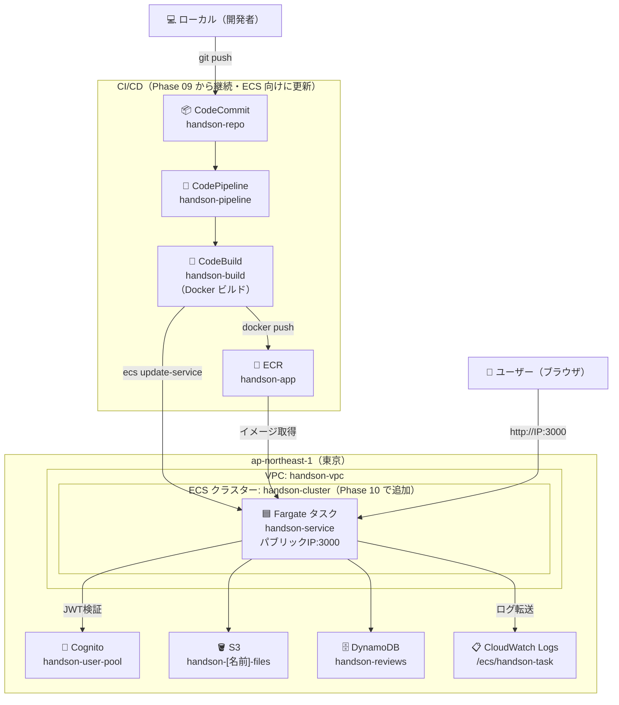

# Phase 10: ECS/Fargate ハンズオン手順

作成日: 2026-05-30

対象: AWS未経験者向けハンズオン（10回目）

---

## 前提条件

| 前提条件 | 確認方法 |
|---------|---------|
| Phase 09 の CodeCommit・CodePipeline が動作していること | CodePipeline コンソール → `handson-pipeline` が成功している |
| `handson-ec2-role` が存在していること | IAM コンソール → ロール → `handson-ec2-role` を確認 |

> ✅ **ALB・EC2 は起動していなくて構わない。**
> 本手順は Fargate コンテナに直接アクセスする構成のため、ALB は不要。
> 費用削減のため、使用しない場合は停止・削除したままで問題ない。

---

## 完成後イメージ

```
ローカルで git push
    ↓
CodeCommit → CodePipeline
    ↓
CodeBuild（Docker イメージをビルド → ECR に push → ECS サービス更新）
    ↓
ECS/Fargate（コンテナが自動起動・パブリック IP が割り当てられる）
    ↓
ブラウザから http://[FargateタスクのパブリックIP]:3000 でアクセス
```

---

## 環境イメージ



---

## 全体の流れ

```
[1] Dockerfile を作成する
    ↓
[2] ECR リポジトリを作成する
    ↓
[3] ECS 用 IAM ロールを準備する
    ↓
[4] ECS クラスターを作成する
    ↓
[5] タスク定義を作成する
    ↓
[6] ECS サービスを作成する
    ↓
[7] 動作確認
    ↓
[8] CI/CD を ECS 向けに更新する
    ↓
[9] ハンズオン終了後のリソース削除
```

---

## AWS 用語集

### コンテナ / Docker

アプリとその実行環境（Node.js・ライブラリなど）をひとまとめにした箱のようなもの。
「どの EC2 でも同じ環境で動く」ことが保証される。

```
【今まで】
EC2 に Node.js をインストール → アプリを配置 → 起動
（EC2 の状態に依存）

【コンテナ化後】
Docker イメージ（環境ごとパッケージ）→ どこでも同じように起動
```

### Dockerfile

コンテナイメージを作るための設計書。
「どの Node.js バージョンを使い、どのファイルをコピーし、何を実行するか」を記述する。

### イメージ / レジストリ

**イメージ**: Dockerfile からビルドした完成品（設計図から作った実行可能なパッケージ）。
**レジストリ**: イメージを保管・管理する場所。AWS では ECR がこれにあたる。

### ECR（Elastic Container Registry）

Docker イメージを AWS 上で保管するサービス。
GitHub に対する Docker Hub のような位置づけ。

### ECS（Elastic Container Service）

コンテナの起動・管理・スケーリングを行うサービス。
「このイメージを何個起動して…」という設定を管理する。

### Fargate

ECS でコンテナを動かすための実行環境。
EC2 を自分で管理せずにコンテナを動かせる（サーバーレスなコンテナ実行環境）。

```
【EC2 起動タイプ】EC2 インスタンスを自分で管理 → その上でコンテナを動かす
【Fargate 起動タイプ】EC2 不要 → AWS がインフラを管理 → コンテナだけ定義すればOK
```

### タスク定義

ECS でコンテナを起動するための設定書。
「どのイメージを使い、CPU・メモリはどれくらいで、環境変数は何か」を定義する。

### ECS サービス

タスク定義をもとに「常に N 個のコンテナを維持する」設定。
コンテナが落ちたら自動で再起動する。

### クラスター

ECS のコンテナをまとめて管理する単位。フォルダのようなもの。

---

## [1] Dockerfile を作成する

### 1-1. Dockerfile をリポジトリルートに作成する

`/mnt/c/Users/ohtsu/Documents/AWS/claudecode/Dockerfile` を作成：

```dockerfile
# ── ステージ1: フロントエンドのビルド ──
FROM node:22-alpine AS frontend-builder
WORKDIR /app/frontend
COPY phase05/frontend/package*.json ./
RUN npm ci
COPY phase05/frontend/ ./
RUN npm run build

# ── ステージ2: バックエンドのビルド ──
FROM node:22-alpine AS backend-builder
WORKDIR /app/backend
COPY phase05/backend/package*.json ./
RUN npm ci
COPY phase05/backend/ ./
RUN npm run build

# ── ステージ3: 本番イメージ ──
FROM node:22-alpine
WORKDIR /app/backend

# バックエンドの本番依存関係のみインストール
COPY phase05/backend/package*.json ./
RUN npm ci --omit=dev

# ビルド済みファイルをコピー
COPY --from=backend-builder /app/backend/dist ./dist
COPY --from=frontend-builder /app/frontend/dist ../frontend/dist

EXPOSE 3000
CMD ["node", "dist/index.js"]
```

> **マルチステージビルドとは:**
> ビルド環境（node_modules 含む）と本番環境を分けることで、
> イメージサイズを小さく保つ手法。本番イメージには不要なファイルが含まれない。

---

### 1-2. .dockerignore を作成する

不要なファイルをイメージに含めないよう `.dockerignore` を作成する。

`/mnt/c/Users/ohtsu/Documents/AWS/claudecode/.dockerignore`：

```
node_modules
*/node_modules
*/dist
.git
*.md
.env
```

---

## [2] ECR リポジトリを作成する

1. ECR コンソールを開く（リージョン：東京 ap-northeast-1）
2. **「リポジトリを作成」** をクリック
3. 以下を入力：

| 項目 | 値 |
|------|---|
| 可視性設定 | プライベート |
| リポジトリ名 | `handson-app` |

4. **「リポジトリを作成」** をクリック
5. 作成されたリポジトリの **URI** を控える
   （例：`123456789012.dkr.ecr.ap-northeast-1.amazonaws.com/handson-app`）

---

## [3] ECS 用 IAM ロールを準備する

ECS/Fargate では 2 種類の IAM ロールが必要になる。

| ロール | 用途 |
|--------|------|
| タスク実行ロール | ECR からイメージを取得・CloudWatch Logs にログを書き込む権限 |
| タスクロール | コンテナ内のアプリが DynamoDB・S3・Cognito 等を使う権限 |

### 3-1. タスク実行ロールを作成する

1. IAM コンソール → **「ロールを作成」**
2. **信頼されたエンティティタイプ**：「AWS のサービス」
3. **ユースケース**：「Elastic Container Service」→「**Elastic Container Service Task**」を選択 → **「次へ」**
4. `AmazonECSTaskExecutionRolePolicy` にチェック → **「次へ」**
5. **ロール名**：`handson-ecs-task-execution-role` → **「ロールを作成」**

---

### 3-2. タスクロールの確認

タスクロールは既存の `handson-ec2-role` を流用できる。
DynamoDB・S3・Cognito・Bedrock 等の権限がそのまま使える。

---

### 3-3. CodeBuild のロールに ECR・ECS 権限を追加する

1. IAM コンソール → **ロール** → `codebuild-handson-build-service-role` を開く
2. **「許可を追加」** → **「ポリシーをアタッチ」**
3. 以下の 2 つを追加：

| ポリシー名 | 用途 |
|-----------|------|
| `AmazonEC2ContainerRegistryFullAccess` | ECR へのログイン・push |
| `AmazonECS_FullAccess` | ECS サービスの更新 |

---

## [4] ECS クラスターを作成する

1. ECS コンソールを開く
2. **「クラスターの作成」** をクリック
3. 以下を設定：

| 項目 | 値 |
|------|---|
| クラスター名 | `handson-cluster` |
| インフラストラクチャ | AWS Fargate（サーバーレス） |

4. **「作成」** をクリック

---

## [5] タスク定義を作成する

### 5-1. タスク定義を作成する

1. ECS コンソール → **「タスク定義」** → **「新しいタスク定義の作成」**
2. 以下を設定：

**タスク定義の設定：**

| 項目 | 値 |
|------|---|
| タスク定義ファミリー | `handson-task` |
| 起動タイプ | AWS Fargate |
| オペレーティングシステム | Linux/X86_64 |
| CPU | 0.5 vCPU |
| メモリ | 1 GB |
| タスク実行ロール | `handson-ecs-task-execution-role` |
| タスクロール | `handson-ec2-role` |

**コンテナの設定：**

| 項目 | 値 |
|------|---|
| コンテナ名 | `handson-app` |
| イメージ URI | `[ECR の URI]/handson-app:latest`（[2] で控えた URI） |
| コンテナポート | `3000` |
| プロトコル | TCP |

---

### 5-2. 環境変数を設定する

`.env` に書いていた値をコンテナの環境変数として設定する。

コンテナの設定画面 → **「環境変数」** に以下を追加：

| キー | 値 |
|------|---|
| `AWS_REGION` | `ap-northeast-1` |
| `S3_BUCKET_NAME` | `handson-[名前]-files` |
| `COGNITO_USER_POOL_ID` | Cognito コンソールで確認 |
| `COGNITO_CLIENT_ID` | Cognito コンソールで確認 |
| `DYNAMODB_TABLE_NAME` | `handson-reviews` |
| `BEDROCK_REGION` | `us-east-1` |
| `PORT` | `3000` |

> EC2 が起動している場合は以下で値を確認できる。
> ```bash
> cat /root/samurai-repo/phase05/backend/.env
> ```

---

### 5-3. ログの設定をする

**「ログ収集を使用」** にチェックが入っていることを確認（デフォルトで有効）。

| 項目 | 値 |
|------|---|
| ログドライバー | awslogs |
| ロググループ | `/ecs/handson-task`（自動生成） |

**「作成」** をクリック。

---

## [6] ECS サービスを作成する

### 6-1. セキュリティグループを作成する

Fargate タスクへのアクセスを許可するセキュリティグループを作成する。

1. EC2 コンソール → **「セキュリティグループ」** → **「セキュリティグループを作成」**
2. 以下を設定：

| 項目 | 値 |
|------|---|
| セキュリティグループ名 | `handson-ecs-sg` |
| 説明 | `ECS Fargate task SG` |
| VPC | `handson-vpc` |

**インバウンドルール：**

| タイプ | プロトコル | ポート | ソース |
|--------|-----------|--------|--------|
| カスタム TCP | TCP | 3000 | マイ IP |

> **マイ IP** を選択すると、自分のグローバル IP のみアクセスを許可できる。
> 学習目的で一時的に公開する場合のみ `0.0.0.0/0`（すべて）を選択する。

3. **「セキュリティグループを作成」**

---

### 6-2. サービスを作成する

1. ECS コンソール → `handson-cluster` → **「サービスの作成」**
2. 以下を設定：

**環境：**

| 項目 | 値 |
|------|---|
| 起動タイプ | Fargate |
| プラットフォームバージョン | LATEST |

**デプロイ設定：**

| 項目 | 値 |
|------|---|
| アプリケーションタイプ | サービス |
| ファミリー | `handson-task` |
| サービス名 | `handson-service` |
| 必要なタスク数 | `1` |

**ネットワーキング：**

| 項目 | 値 |
|------|---|
| VPC | `handson-vpc` |
| サブネット | `handson-public-subnet-1a`（1つ選択） |
| セキュリティグループ | `handson-ecs-sg`（既存を選択） |
| パブリック IP | **オン**（これがないと外からアクセスできない） |

**ロードバランシング：**

| 項目 | 値 |
|------|---|
| ロードバランサーの使用 | **なし** |

3. **「作成」** をクリック

---

## [7] 動作確認

### 7-1. タスクのパブリック IP を確認する

1. ECS コンソール → `handson-cluster` → `handson-service` → **「タスク」** タブ
2. 起動しているタスクをクリック
3. **「パブリック IP」** の値を控える（例：`54.xxx.xxx.xxx`）

> ⏱️ タスクが `RUNNING` になるまで 2〜3 分かかる。

> **タスクが `STOPPED` になる場合:**
> タスクを選択 → **「ログ」** タブでエラー内容を確認する。
> 環境変数の設定ミスや、イメージの pull 失敗が多い。

---

### 7-2. ブラウザでアクセスする

```
http://[パブリックIP]:3000
```

- [ ] トップページが表示される
- [ ] ログインできる（Cognito 認証）
- [ ] レビュー一覧が取得できる
- [ ] S3 ファイル管理が動作する

> ⚠️ **タスクを再起動するとパブリック IP が変わる。**
> 毎回タスクタブで IP を確認すること。

---

## [8] CI/CD を ECS 向けに更新する

### 8-1. buildspec.yml を書き換える

`/mnt/c/Users/ohtsu/Documents/AWS/claudecode/buildspec.yml` を以下に書き換える：

```yaml
version: 0.2

env:
  variables:
    AWS_DEFAULT_REGION: ap-northeast-1
    ECR_REPO_NAME: handson-app
    ECS_CLUSTER: handson-cluster
    ECS_SERVICE: handson-service

phases:
  pre_build:
    commands:
      - echo Logging in to Amazon ECR...
      - AWS_ACCOUNT_ID=$(aws sts get-caller-identity --query Account --output text)
      - ECR_URI=$AWS_ACCOUNT_ID.dkr.ecr.$AWS_DEFAULT_REGION.amazonaws.com/$ECR_REPO_NAME
      - aws ecr get-login-password --region $AWS_DEFAULT_REGION | docker login --username AWS --password-stdin $ECR_URI

  build:
    commands:
      - echo Building Docker image...
      - docker build -t $ECR_URI:latest -t $ECR_URI:$CODEBUILD_RESOLVED_SOURCE_VERSION .

  post_build:
    commands:
      - echo Pushing Docker image to ECR...
      - docker push $ECR_URI:latest
      - docker push $ECR_URI:$CODEBUILD_RESOLVED_SOURCE_VERSION
      - echo Updating ECS service...
      - aws ecs update-service --cluster $ECS_CLUSTER --service $ECS_SERVICE --force-new-deployment
      - echo Done.
```

---

### 8-2. CodeBuild で Docker を使えるようにする

CodeBuild はデフォルトでは Docker が使えない設定になっている。

1. CodeBuild コンソール → `handson-build` → **「編集」** → **「環境」**
2. **「特権付与」** にチェックを入れる（Docker デーモンを使うために必要）
3. **「環境の更新」** をクリック

---

### 8-3. CodePipeline からデプロイステージを削除する

Phase 09 のパイプラインには CodeDeploy のデプロイステージがあるが、
ECS 向けでは `buildspec.yml` 内で `aws ecs update-service` を実行するため不要。

1. CodePipeline コンソール → `handson-pipeline` → **「編集」**
2. **「Deploy」** ステージ → **「ステージを削除」**
3. **「保存」**

---

### 8-4. 動作確認

コードを変更して CodeCommit に push する。

```bash
cd /mnt/c/Users/ohtsu/Documents/AWS/claudecode
git add .
git commit -m "feat: ECS/Fargate 対応"
git push codecommit main
```

CodePipeline コンソールで以下を確認する：

| ステージ | 内容 |
|---------|------|
| Source | CodeCommit から取得 |
| Build | Docker ビルド → ECR push → ECS サービス更新 |

ECS コンソール → `handson-service` → **「タスク」** タブで新しいタスクが起動したら、
IP を確認してブラウザでアクセスする。

---

## [9] ハンズオン終了後のリソース削除

| リソース | 削除場所 |
|---------|---------|
| ECS サービス | ECS → `handson-cluster` → `handson-service` → 削除 |
| ECS クラスター | ECS → `handson-cluster` → 削除 |
| タスク定義 | ECS → タスク定義 → `handson-task` → 登録解除 |
| ECR リポジトリ | ECR → `handson-app` → 削除 |
| セキュリティグループ | EC2 → セキュリティグループ → `handson-ecs-sg` → 削除 |
| IAM ロール | IAM → `handson-ecs-task-execution-role` → 削除 |
| CloudWatch ロググループ | CloudWatch → `/ecs/handson-task` → 削除 |

---

## コスト目安

| リソース | 費用 | 備考 |
|---------|------|------|
| Fargate（0.5vCPU / 1GB） | 約 $0.025/時間 → **約 $18/月** | 起動中は課金される。ハンズオン後は必ず削除すること |
| ECR | $0.10/GB/月 | イメージサイズによるが数十円程度 |

> ⚠️ Fargate は EC2 と異なり「停止」という概念がない。
> 使い終わったらサービスごと削除すること。
