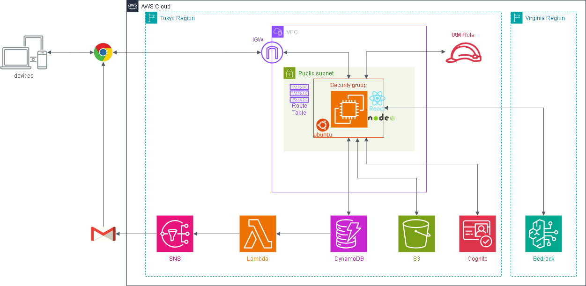

# AWS 学習ハンズオン

AWS の主要サービスを段階的に学ぶためのハンズオン用アプリです。  
Phase 1 から順番に進めることで、EC2・S3・Cognito・DynamoDB・Lambda・Bedrock・ALB・CloudFront を実際に構築しながら学べます。

## フェーズ構成

| フェーズ | 内容 | 手順書 |
|---------|------|-------|
| Phase 1 | EC2・S3・IAM・VPC（ファイル管理アプリ） | [手順書](01_EC2_S3_IAM_VPC_ハンズオン手順.md) |
| Phase 2 | Cognito（ログイン・認証） | [手順書](02_Cognito_ハンズオン手順.md) |
| Phase 3 | DynamoDB（レビュー投稿・蓄積） | [手順書](03_DynamoDB_ハンズオン手順.md) |
| Phase 4 | Lambda・SNS（レビュー投稿メール通知） | [手順書](04_Lambda_SNS_ハンズオン手順.md) |
| Phase 5 | Bedrock（AI分析・傾向可視化） | [手順書](05_Bedrock_ハンズオン手順.md) |
| Phase 6 | ALB + Auto Scaling（高可用性構成） | [手順書](06_ALB_AutoScaling_ハンズオン手順.md) |
| Phase 7 | CloudFront（CDN・HTTPS化） | [手順書](07_CloudFront_ハンズオン手順.md) |
| Phase 8 | CloudWatch Logs + SNS（監視・アラート） | [手順書](08_CloudWatch_SNS_ハンズオン手順.md) |

## アーキテクチャ全体像

